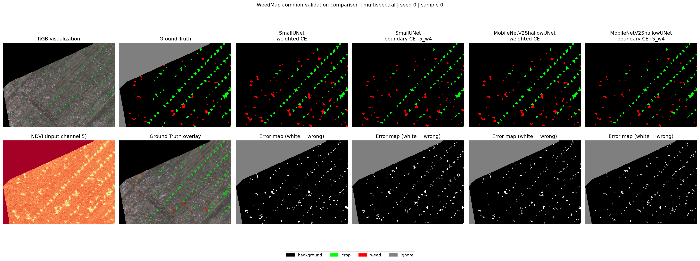

# 真实 WeedMap 实验记录

## 真实数据训练目标

本实验使用真实 WeedMap tiles 训练现有的小型 U-Net，完成 background、crop 和 weed 三类像素级语义分割。训练过程记录验证集 pixel accuracy、mean IoU 及三个类别各自的 IoU，为后续输入形式和损失函数对比提供统一基线。

## 为什么使用 `ignore_index=255`

真实数据的有效区域 mask 会把无数据、边缘或不应参与监督的像素标记为 255。模型只有 0=background、1=crop、2=weed 三个输出类别，255 不是第 4 类。训练和评估都必须忽略这些像素，否则会错误惩罚模型、污染混淆矩阵，并使指标不能代表有效标注区域的表现。

## 为什么先使用 multispectral

多光谱输入包含 G、R、RedEdge、NIR 和 NDVI 五个通道。RedEdge、NIR 和植被指数能补充 RGB 中不明显的植被光谱信息，因此先用 multispectral 建立更贴近 WeedMap 数据特点的真实数据基线。

## 为什么使用 weighted_ce

真实农田图像通常存在明显类别不平衡，background 像素较多，weed 像素较少。默认使用 background=1.0、crop=4.0、weed=8.0 的 weighted cross entropy，提高作物和杂草误分类的代价，减少训练被背景类别主导的风险。最终效果仍需结合各类别 IoU 判断。

## 第一次真实训练结果

- `input_type=multispectral`
- `loss=weighted_ce`
- `epochs=3`
- train loss：`0.4497 -> 0.2724 -> 0.2532`
- Epoch 3 val pixel accuracy：`95.61%`
- val mean IoU：`56.37%`
- background IoU：`97.15%`
- crop IoU：`56.28%`
- weed IoU：`15.68%`

整体像素准确率较高，但 weed IoU 明显低于 background 和 crop。下一步将通过真实预测可视化检查 weed 的漏检、误检、边界混淆及小目标表现，分析 weed IoU 较低的原因。

## 真实 WeedMap 10 epochs 稳定性实验

### 实验设置

- `input_type=multispectral`
- `loss=weighted_ce`
- `epochs=10`
- `batch_size=2`
- class weights：`background=1.0`、`crop=4.0`、`weed=8.0`
- `ignore_index=255`
- train samples：`707`
- val samples：`177`

### 训练结果

| Epoch | Train loss | Val pixel accuracy | Val mean IoU | Background IoU | Crop IoU | Weed IoU |
| ---: | ---: | ---: | ---: | ---: | ---: | ---: |
| 1/10 | 0.4497 | 95.38% | 52.28% | 96.99% | 47.65% | 12.18% |
| 2/10 | 0.2724 | 95.25% | 52.53% | 96.84% | 49.52% | 11.24% |
| 3/10 | 0.2532 | 95.61% | 56.37% | 97.15% | 56.28% | 15.68% |
| 4/10 | 0.2455 | 95.12% | 56.41% | 96.76% | 50.87% | 21.59% |
| 5/10 | 0.2364 | 95.52% | 54.94% | 96.83% | 55.68% | 12.31% |
| 6/10 | 0.2365 | 95.50% | 54.14% | 96.81% | 53.91% | 11.70% |
| 7/10 | 0.2257 | 95.07% | 57.62% | 96.18% | 57.81% | 18.86% |
| 8/10 | 0.2099 | 96.40% | 62.65% | 97.17% | 62.13% | 28.66% |
| 9/10 | 0.2019 | 96.29% | 63.80% | 97.14% | 60.38% | 33.90% |
| 10/10 | 0.1781 | 97.22% | 69.21% | 97.69% | 64.17% | 45.76% |

### 3 epochs 与 10 epochs 对比

| 训练轮数 | Val mean IoU | Weed IoU |
| ---: | ---: | ---: |
| 3 epochs | 56.37% | 15.68% |
| 10 epochs | 69.21% | 45.76% |

weed IoU 从 `15.68%` 提升到 `45.76%`，说明增加训练轮数对真实 WeedMap 的 weed 类非常有效。

### 10 epochs 预测可视化结果

- sample index：`0`
- pixel accuracy：`95.49%`
- background IoU：`96.24%`
- crop IoU：`56.40%`
- weed IoU：`37.34%`
- mean IoU：`63.33%`

### 实验现象总结

- background IoU 一直较高，因为背景像素占比大且更容易识别。
- crop IoU 稳定提升。
- weed IoU 前期波动较大，但 Epoch 8 到 Epoch 10 明显上升。
- 真实 WeedMap 中 weed 是最难类别，训练轮数不足时容易漏检。
- 不能只看 pixel accuracy，必须重点看 weed IoU 和 mean IoU。

## 严格公平 RGB vs Multispectral 对比实验

### 实验设置

- `sample_list_csv=splits/real_weedmap_common_samples.csv`
- RGB 和 Multispectral 使用完全相同的 454 个样本
- train samples：`363`
- val samples：`91`
- `input_type` 分别为 `rgb` 和 `multispectral`
- `loss=weighted_ce`
- `epochs=10`
- `batch_size=2`
- class weights：`background=1.0`、`crop=4.0`、`weed=8.0`
- `ignore_index=255`

RGB 和 Multispectral 使用同一个 sample list、相同样本数和相同训练/验证划分，因此这次对比比之前样本集合不同的实验更公平，可以更可靠地比较输入通道带来的差异。

### 实验结果

| Input | Train Loss | Val Pixel Acc | Mean IoU | Background IoU | Crop IoU | Weed IoU |
|---|---:|---:|---:|---:|---:|---:|
| RGB | 0.2956 | 94.28% | 65.27% | 95.49% | 65.75% | 34.56% |
| Multispectral | 0.2166 | 94.38% | 67.76% | 94.94% | 61.62% | 46.73% |

### 结果解释

1. Multispectral 的 mean IoU 为 67.76%，高于 RGB 的 65.27%，说明整体分割效果略好。
2. Multispectral 的 weed IoU 为 46.73%，比 RGB 的 34.56% 高 12.17 个百分点，说明多光谱通道对杂草识别更有帮助。
3. RGB 的 crop IoU 为 65.75%，比 Multispectral 的 61.62% 高 4.13 个百分点，说明 RGB 对作物行状结构也有一定优势。
4. 对导师课题来说，weed 是关键难点，因此多光谱方向更值得继续深入。

### 最佳轮次与训练波动

Multispectral 在 Epoch 8 达到更好结果：mean IoU 为 70.38%，weed IoU 为 50.43%；Epoch 10 的 mean IoU 为 67.76%，weed IoU 为 46.73%。真实 WeedMap 训练后期存在波动，后续实验应优先报告验证集 mean IoU 最优的 best checkpoint 指标，而不仅仅是最后一轮指标。训练脚本现已同时保存 best checkpoint 和最后一轮模型。

## Best checkpoint 验证结果

在严格公平 multispectral 实验中，训练脚本已经支持根据 val mean IoU 保存 best checkpoint。

### 整体验证集结果

- best epoch = 8
- best val mean IoU = 70.38%
- best background IoU = 96.09%
- best crop IoU = 64.61%
- best weed IoU = 50.43%
- best model path = `models/real_weedmap_common_multispectral_weighted_ce_10epochs_best.pth`

与最后一轮 Epoch 10 对比：

- Epoch 10 val mean IoU = 67.76%
- Epoch 10 weed IoU = 46.73%
- best Epoch 8 val mean IoU = 70.38%
- best Epoch 8 weed IoU = 50.43%

这组结果说明：

1. 真实 WeedMap 训练后期存在波动。
2. 最后一轮模型不一定是最优模型。
3. 保存 best checkpoint 可以避免因为后期波动导致最终模型性能下降。
4. 后续实验应优先报告 best checkpoint 的结果。

### 单张 sample index=0 预测可视化结果

| Model | Pixel Acc | Mean IoU | Background IoU | Crop IoU | Weed IoU |
|---|---:|---:|---:|---:|---:|
| Epoch 10 final | 92.63% | 57.12% | 93.41% | 48.42% | 29.53% |
| Best checkpoint | 94.19% | 60.77% | 94.96% | 53.49% | 33.85% |

best checkpoint 在验证集整体指标和单张预测可视化指标上都优于最后一轮模型，因此后续真实 WeedMap 实验应保存并使用 best checkpoint。

## Weed class weight 调参实验

### 实验设置

- `sample_list_csv=splits/real_weedmap_common_samples.csv`
- `input_type=multispectral`
- RGB 和 multispectral 公平对比后，继续在 multispectral 上调参
- `loss=weighted_ce`
- `epochs=10`
- `batch_size=2`
- train samples：`363`
- val samples：`91`
- background weight：`1.0`
- crop weight：`4.0`
- weed weight：`8`、`12`、`16`
- `ignore_index=255`
- 使用 best checkpoint，根据 val mean IoU 保存最佳模型

### 实验结果

| Weed Weight | Best Epoch | Best Mean IoU | Background IoU | Crop IoU | Weed IoU |
|---:|---:|---:|---:|---:|---:|
| 8 | 8 | 70.38% | 96.09% | 64.61% | 50.43% |
| 12 | 8 | 69.64% | 95.25% | 64.63% | 49.04% |
| 16 | 8 | 67.98% | 94.72% | 62.88% | 46.36% |

### 结果解释

1. `weed weight=8` 当前效果最好，best mean IoU 和 weed IoU 都最高。
2. `weed weight=12` 与 8 接近，但两项指标略低。
3. `weed weight=16` 时，mean IoU 和 weed IoU 均下降。
4. weed 权重不是越大越好；过大的 weed 权重可能破坏 background、crop、weed 三类之间的平衡。
5. 当前后续实验可以继续以 `background=1.0`、`crop=4.0`、`weed=8.0` 作为默认 weighted CE 设置。
6. 后续若继续调参，可以尝试更细粒度的 `weed weight=10`，或者改用 Focal Loss / Dice + CE。

## 20 epochs 训练实验

### 实验设置

- `sample_list_csv=splits/real_weedmap_common_samples.csv`
- `input_type=multispectral`
- `loss=weighted_ce`
- class weights：`background=1.0`、`crop=4.0`、`weed=8.0`
- `epochs=20`
- `batch_size=2`
- train samples：`363`
- val samples：`91`
- `ignore_index=255`
- 使用 best checkpoint，根据 val mean IoU 保存最佳模型

### 验证集整体结果

| Setting | Best Epoch | Pixel Acc | Mean IoU | Background IoU | Crop IoU | Weed IoU |
|---|---:|---:|---:|---:|---:|---:|
| 10 epochs best | 8 | 95.47% | 70.38% | 96.09% | 64.61% | 50.43% |
| 20 epochs best | 15 | 95.97% | 73.88% | 96.20% | 70.89% | 54.54% |

20 epochs best checkpoint 明显优于 10 epochs best checkpoint：mean IoU 从 70.38% 提升到 73.88%，weed IoU 从 50.43% 提升到 54.54%，crop IoU 从 64.61% 提升到 70.89%。这说明在真实 WeedMap 上继续训练到 20 epochs 是有效的。

但 Epoch 15 之后指标仍有波动。例如，Epoch 20 的 mean IoU 降到 69.52%，weed IoU 降到 46.82%，因此 best checkpoint 机制仍然必要。

### 单张 sample index=0 可视化结果

| Model | Pixel Acc | Mean IoU | Background IoU | Crop IoU | Weed IoU |
|---|---:|---:|---:|---:|---:|
| 10 epochs best | 94.19% | 60.77% | 94.96% | 53.49% | 33.85% |
| 20 epochs best | 94.82% | 63.90% | 95.32% | 59.39% | 36.99% |

单张预测可视化上，20 epochs best 同样优于 10 epochs best。错误仍主要集中在 crop/weed 边界、小目标 weed 以及植物混杂区域。后续可以继续尝试更长训练，例如 30 epochs，但必须使用 best checkpoint。20 epochs 的多 seed 重复结果见下节。

## SmallUNet baseline：20 epochs 多 seed 重复实验

### 实验设置

- `sample_list_csv=splits/real_weedmap_common_samples.csv`
- `input_type=multispectral`
- `loss=weighted_ce`
- class weights：`background=1.0`、`crop=4.0`、`weed=8.0`
- `epochs=20`
- `batch_size=2`
- train samples：`363`
- val samples：`91`
- `ignore_index=255`
- seeds：`0`、`1`、`2`
- 使用 best checkpoint，根据 val mean IoU 保存最佳模型

### 各 seed 的 best checkpoint 验证集结果

| Seed | Best Epoch | Pixel Acc | Mean IoU | Background IoU | Crop IoU | Weed IoU |
|---:|---:|---:|---:|---:|---:|---:|
| 0 | 15 | 95.97% | 73.88% | 96.20% | 70.89% | 54.54% |
| 1 | 15 | 96.51% | 74.99% | 96.96% | 69.59% | 58.44% |
| 2 | 15 | 96.65% | 75.47% | 96.94% | 71.80% | 57.68% |

### 多 seed 均值与样本标准差

| Metric | Mean ± Std |
|---|---:|
| Pixel Accuracy | 96.38% ± 0.36% |
| Mean IoU | 74.78% ± 0.82% |
| Background IoU | 96.70% ± 0.43% |
| Crop IoU | 70.76% ± 1.11% |
| Weed IoU | 56.89% ± 2.06% |

三个 seed 的 best epoch 均为 Epoch 15，说明当前设置在 20 epochs 内的最佳轮次比较稳定。三个 seed 的 mean IoU 位于 73.88%～75.47%，波动较小；weed IoU 均超过 54%，明显高于 10 epochs best 的 50.43%。多 seed 平均 weed IoU 为 56.89% ± 2.06%，支持 20 epochs 的提升不是偶然的单次结果。当前可将 `multispectral + weighted CE + class weights 1/4/8 + 20 epochs + best checkpoint` 作为后续 baseline。

## Loss 多 seed 对比实验

### 实验设置

- `sample_list_csv=splits/real_weedmap_common_samples.csv`
- `input_type=multispectral`
- `epochs=20`，`batch_size=2`
- train samples：`363`；val samples：`91`
- `ignore_index=255`
- seeds：`0`、`1`、`2`
- 使用 best checkpoint，根据 val mean IoU 保存最佳模型
- 对比 Weighted CE（`background=1.0`、`crop=4.0`、`weed=8.0`）、Focal Loss、Dice + CE。Weighted CE 各 seed 明细见前述 SmallUNet baseline。

### Focal Loss：各 seed 的 best checkpoint 验证集结果

| Seed | Best Epoch | Pixel Acc | Mean IoU | Background IoU | Crop IoU | Weed IoU |
|---:|---:|---:|---:|---:|---:|---:|
| 0 | 20 | 96.59% | 74.72% | 97.09% | 69.55% | 57.52% |
| 1 | 19 | 96.51% | 72.56% | 97.17% | 66.14% | 54.36% |
| 2 | 19 | 96.99% | 74.73% | 97.30% | 72.12% | 54.77% |

### Dice + CE：各 seed 的 best checkpoint 验证集结果

| Seed | Best Epoch | Pixel Acc | Mean IoU | Background IoU | Crop IoU | Weed IoU |
|---:|---:|---:|---:|---:|---:|---:|
| 0 | 18 | 96.81% | 76.35% | 97.17% | 72.07% | 59.82% |
| 1 | 19 | 96.92% | 76.44% | 97.26% | 71.39% | 60.67% |
| 2 | 16 | 96.46% | 70.56% | 97.20% | 65.14% | 49.35% |

### 三种 loss 的均值与样本标准差

| Loss | Pixel Acc | Mean IoU | Background IoU | Crop IoU | Weed IoU |
|---|---:|---:|---:|---:|---:|
| Weighted CE | 96.38% ± 0.36% | 74.78% ± 0.82% | 96.70% ± 0.43% | 70.76% ± 1.11% | 56.89% ± 2.06% |
| Focal Loss | 96.69% ± 0.26% | 74.00% ± 1.25% | 97.19% ± 0.11% | 69.27% ± 3.00% | 55.55% ± 1.72% |
| Dice + CE | 96.73% ± 0.24% | 74.45% ± 3.37% | 97.21% ± 0.05% | 69.54% ± 3.82% | 56.61% ± 6.31% |

Weighted CE 的平均 mean IoU 最高，为 74.78% ± 0.82%；平均 weed IoU 也最高，为 56.89% ± 2.06%。Focal Loss 的 background IoU 较高，weed IoU 的跨 seed 波动也较小，但平均 weed IoU 略低于 Weighted CE。Dice + CE 在 seed=0 和 seed=1 上表现很强，seed=2 的 mean IoU 和 weed IoU 明显下降，因此样本标准差较大。当前阶段最稳的主 baseline 仍是 `multispectral + weighted CE + class weights 1/4/8 + 20 epochs + best checkpoint`。Dice + CE 有后续探索价值，需要进一步调参或增加 seed 验证稳定性。

## Boundary error analysis

### 问题观察与结构检查

预测可视化显示，错误主要集中在 crop/weed 轮廓附近，Error map 中有许多白色边界圈。检查当前 `unet.py`：模型已有 encoder-decoder skip connection，使用 `torch.cat(..., dim=1)` 进行 concat，而非 add。因此问题并非缺少 skip connection，而是当前普通 U-Net 的边界精细化能力仍然不足。

### Boundary error analysis：Weighted CE 20 epochs best，sample index=0

| 统计项 | 结果 |
|---|---:|
| Total valid pixels | 112158 |
| Total error pixels | 5812 |
| Overall error rate | 5.18% |
| Errors within 1px boundary | 4504（占错误 77.49%） |
| Errors within 3px boundary | 5372（占错误 92.43%） |
| Errors within 5px boundary | 5532（占错误 95.18%） |
| Errors outside 5px boundary | 280（占错误 4.82%） |
| Valid pixels within 5px boundary | 38199（占有效像素 34.06%） |
| Error rate within 5px boundary | 14.48% |
| Error rate outside 5px boundary | 0.38% |

5px 边界区域仅占有效像素的 34.06%，却包含 95.18% 的错误像素；该区域错误率为 14.48%，远高于非边界区域的 0.38%。当前模型的主要瓶颈集中在边界区域，而非大面积内部区域。

## SmallUNet + boundary weighted CE r5_w4

以下保留 r5_w3 对照，再记录 r5_w4 调参结果。

### Boundary weighted CE 实验设置与三 seed 结果（r5_w3）

- `loss=boundary_weighted_ce`，`boundary radius=5`，`boundary weight=3.0`；
- `input_type=multispectral`，`epochs=20`，`batch_size=2`；
- `sample_list_csv=splits/real_weedmap_common_samples.csv`；
- 使用 best checkpoint。

| Seed | Best Epoch | Pixel Acc | Mean IoU | Background IoU | Crop IoU | Weed IoU |
|---:|---:|---:|---:|---:|---:|---:|
| 0 | 20 | 96.71% | 75.95% | 97.10% | 71.66% | 59.09% |
| 1 | 16 | 96.73% | 73.84% | 97.15% | 68.42% | 55.97% |
| 2 | 18 | 97.04% | 75.43% | 97.33% | 71.06% | 57.92% |

三 seed 均值 ± 样本标准差：

| Metric | Mean ± Std |
|---|---:|
| Pixel Accuracy | 96.83% ± 0.19% |
| Mean IoU | 75.08% ± 1.10% |
| Background IoU | 97.19% ± 0.12% |
| Crop IoU | 70.38% ± 1.73% |
| Weed IoU | 57.66% ± 1.58% |

与原 Weighted CE 的三 seed 结果对比（均值 ± 样本标准差）：

| Loss | Pixel Acc | Mean IoU | Background IoU | Crop IoU | Weed IoU |
|---|---:|---:|---:|---:|---:|
| Weighted CE | 96.38% ± 0.36% | 74.78% ± 0.82% | 96.70% ± 0.43% | 70.76% ± 1.11% | 56.89% ± 2.06% |
| Boundary weighted CE（r5_w3） | 96.83% ± 0.19% | 75.08% ± 1.10% | 97.19% ± 0.12% | 70.38% ± 1.73% | 57.66% ± 1.58% |

### Boundary weight=4.0 三 seed 调参结果（r5_w4）

保持 `input_type=multispectral`、`loss=boundary_weighted_ce`、`boundary_radius=5`、`epochs=20`，按验证集 mean IoU 选择 best checkpoint；将 `boundary_weight` 调至 4.0。

| Seed | Best Epoch | Pixel Acc | Mean IoU | Background IoU | Crop IoU | Weed IoU |
|---:|---:|---:|---:|---:|---:|---:|
| 0 | 20 | 96.67% | 75.74% | 97.04% | 70.89% | 59.28% |
| 1 | 16 | 96.73% | 73.99% | 97.14% | 67.37% | 57.45% |
| 2 | 16 | 96.97% | 75.78% | 97.26% | 71.97% | 58.13% |

三 seed 均值 ± 样本标准差：

| Metric | Mean ± Std |
|---|---:|
| Pixel Accuracy | 96.79% ± 0.16% |
| Mean IoU | 75.17% ± 1.02% |
| Background IoU | 97.15% ± 0.11% |
| Crop IoU | 70.07% ± 2.41% |
| Weed IoU | 58.29% ± 0.92% |

与 r5_w3 对比（三 seed 均值 ± 样本标准差）：

| 实验 | Mean IoU | Weed IoU |
|---|---:|---:|
| r5_w3（boundary weight=3.0） | 75.08% ± 1.10% | 57.66% ± 1.58% |
| r5_w4（boundary weight=4.0） | 75.17% ± 1.02% | 58.29% ± 0.92% |

r5_w4 的 mean IoU 平均提高 0.09 个百分点，weed IoU 平均提高 0.63 个百分点，且 weed IoU 的跨 seed 样本标准差从 1.58 降至 0.92 个百分点。提升幅度较小，主要体现在 weed IoU 更高、更稳定。在 `SmallUNet` 的 boundary loss 调参中，较优候选为 `multispectral + boundary_weighted_ce + boundary_radius=5 + boundary_weight=4.0 + 20 epochs + best checkpoint`。

### Sample index=0 的预测与边界错误对比（r5_w3）

| Model | Pixel Acc | Mean IoU | Background IoU | Crop IoU | Weed IoU |
|---|---:|---:|---:|---:|---:|
| Weighted CE 20 epochs best | 94.82% | 63.90% | 95.32% | 59.39% | 36.99% |
| Boundary weighted CE | 96.66% | 68.86% | 97.34% | 66.02% | 43.22% |

Boundary weighted CE 后的 sample index=0 边界错误统计：

| 统计项 | 结果 |
|---|---:|
| Total valid pixels | 112158 |
| Total error pixels | 3746 |
| Overall error rate | 3.34% |
| Errors within 1px boundary | 3155（占错误 84.22%） |
| Errors within 3px boundary | 3580（占错误 95.57%） |
| Errors within 5px boundary | 3630（占错误 96.90%） |
| Errors outside 5px boundary | 116（占错误 3.10%） |
| Valid pixels within 5px boundary | 38199（占有效像素 34.06%） |
| Error rate within 5px boundary | 9.50% |
| Error rate outside 5px boundary | 0.16% |

Sample index=0 的 total error pixels 从 5812 降至 3746，overall error rate 从 5.18% 降至 3.34%；5px boundary error rate 从 14.48% 降至 9.50%，outside 5px error rate 从 0.38% 降至 0.16%。绝对错误数表明 boundary-aware loss 减少了边界附近错误；剩余错误的边界占比仍高，说明边界仍是后续优化重点。

阶段性结论：boundary weighted CE 相比原 Weighted CE 有小幅提升；在 `SmallUNet` 的 boundary weight 调参中，r5_w4 相比 r5_w3 的 weed IoU 更高、更稳定，可作为该组实验的候选结果。继续保留 Weighted CE 作为稳定 baseline。

## MobileNetV2ShallowUNet 方案 A 正式实验

### 结构与参数量

方案 A 是 MobileNetV2-style shallow encoder 改造实验：保留 `SmallUNet` 的 C1/C2、两级 Decoder、skip connection 和 segmentation head，以浅层 MobileNetV2-style inverted residual blocks B1～B6 替换原 `enc2` 与 bottleneck。各级张量形状按高×宽×通道记录：

| Encoder 节点 | 张量形状或通道变化 |
| --- | --- |
| 输入 | 360×480×5 |
| e1 | 360×480×16 |
| B3 | 180×240×24 |
| e2 adapter | 24→32 |
| e2 | 180×240×32 |
| B6 | 90×120×32 |
| center adapter | 32→64 |
| center | 90×120×64 |

Decoder 保持：`center 90×120×64 → up2 180×240×32 → concat e2 180×240×64 → dec2 180×240×32 → up1 360×480×16 → concat e1 360×480×32 → dec1 360×480×16 → head 360×480×3`。

`SmallUNet` total params = 117,363；`MobileNetV2ShallowUNet` total params = 107,155。参数减少 10,208，约 8.7%。由于 `SmallUNet` 本身已经很小，此处只说明**轻微减少参数量**，不称为大幅轻量化。方案 A 不是论文完整 MobileNetV2-U-Net 复现；完整 B1～B17 多尺度版本及更深的多尺度 Decoder 留作方案 B。

### 正式实验设置

- dataset：WeedMap common split（`splits/real_weedmap_common_samples.csv`）
- input：multispectral（5 通道）
- loss：`weighted_ce`；class weights：background 1.0、crop 4.0、weed 8.0
- epochs：20；batch size：2；seeds：0、1、2
- 每个 seed 按验证集 mean IoU 选择 best checkpoint

### 各 seed 的 best checkpoint 验证集结果

| Seed | Best epoch | Pixel accuracy | Mean IoU | Background IoU | Crop IoU | Weed IoU |
| ---: | ---: | ---: | ---: | ---: | ---: | ---: |
| 0 | 15 | 96.04% | 74.86% | 96.31% | 71.21% | 57.04% |
| 1 | 14 | 96.57% | 75.51% | 96.92% | 69.29% | 60.30% |
| 2 | 20 | 96.98% | 77.22% | 97.17% | 74.73% | 59.75% |

### 三 seed 统计及原 SmallUNet baseline 对比

表中 ± 后为三 seed 的样本标准差；提升是方案 A 与 baseline 均值之差，单位为百分点。

| 模型 / 差值 | Pixel accuracy | Mean IoU | Background IoU | Crop IoU | Weed IoU |
| --- | ---: | ---: | ---: | ---: | ---: |
| SmallUNet weighted CE | 96.38% ± 0.36% | 74.78% ± 0.82% | 96.70% ± 0.43% | 70.76% ± 1.11% | 56.89% ± 2.06% |
| MobileNetV2ShallowUNet 方案 A weighted CE | 96.53% ± 0.47% | 75.86% ± 1.22% | 96.80% ± 0.44% | 71.74% ± 2.76% | 59.03% ± 1.74% |
| 方案 A 相对提升（百分点） | +0.15 | +1.08 | +0.10 | +0.98 | +2.14 |

### seed2 best checkpoint 的 sample0 可视化结果

| Pixel accuracy | Background IoU | Crop IoU | Weed IoU | Mean IoU |
| ---: | ---: | ---: | ---: | ---: |
| 96.43% | 96.70% | 68.74% | 45.66% | 70.36% |

这是单张 sample0 的结果，不代表整体验证集或三 seed 均值。方案 A 在三组随机种子上整体优于原 `SmallUNet` weighted CE baseline，尤其提升 weed IoU。这说明 MobileNetV2-style shallow encoder 对当前 WeedMap 多光谱语义分割任务有效；后续方案 B 可以考虑完整 B1～B17 和更深的多尺度 Decoder。

## MobileNetV2ShallowUNet + boundary weighted CE r5_w4

### 实验设置

- dataset：WeedMap common split（`splits/real_weedmap_common_samples.csv`）；input：multispectral；model：`MobileNetV2ShallowUNet`（方案 A）。
- loss：`boundary_weighted_ce`；boundary radius：5；boundary weight：4.0；class weights：background 1.0、crop 4.0、weed 8.0。
- epochs：20；batch size：2；seeds：0、1、2；每个 seed 按验证集 mean IoU 选择 best checkpoint。

### 三 seed best checkpoint 结果

| Seed | Best epoch | Pixel accuracy | Mean IoU | Background IoU | Crop IoU | Weed IoU |
| ---: | ---: | ---: | ---: | ---: | ---: | ---: |
| 0 | 20 | 96.91% | 76.97% | 97.20% | 73.41% | 60.30% |
| 1 | 12 | 96.78% | 76.08% | 97.15% | 71.02% | 60.07% |
| 2 | 18 | 97.25% | 77.07% | 97.44% | 74.69% | 59.10% |

### 三 seed 均值 ± 样本标准差及与前序主线对比

表中为三 seed 均值 ± 样本标准差；差值为相对原 `SmallUNet + weighted CE` 的百分点。

| 模型 / 损失 | Pixel accuracy | Mean IoU | Background IoU | Crop IoU | Weed IoU |
| --- | ---: | ---: | ---: | ---: | ---: |
| SmallUNet / weighted CE | 96.38% ± 0.36% | 74.78% ± 0.82% | 96.70% ± 0.43% | 70.76% ± 1.11% | 56.89% ± 2.06% |
| SmallUNet / boundary weighted CE r5_w4 | 96.79% ± 0.16% | 75.17% ± 1.02% | 97.15% ± 0.11% | 70.07% ± 2.41% | 58.29% ± 0.92% |
| MobileNetV2ShallowUNet 方案 A / weighted CE | 96.53% ± 0.47% | 75.86% ± 1.22% | 96.80% ± 0.44% | 71.74% ± 2.76% | 59.03% ± 1.74% |
| MobileNetV2ShallowUNet 方案 A / boundary weighted CE r5_w4 | **96.98% ± 0.24%** | **76.71% ± 0.55%** | **97.26% ± 0.16%** | **73.04% ± 1.86%** | **59.82% ± 0.64%** |
| 相对 SmallUNet / weighted CE 提升（百分点） | +0.60 | +1.93 | +0.56 | +2.28 | +2.93 |

目前最强语义分割结果来自 MobileNetV2ShallowUNet + boundary weighted CE r5_w4，在三 seed 上达到 Mean IoU 76.71% ± 0.55%、Weed IoU 59.82% ± 0.64%。这说明浅层 MobileNetV2-style encoder 与 boundary-aware loss 可以叠加提升，尤其对 weed 类识别更有帮助。

## VCR 植被覆盖率评判指标

`VCR = vegetation pixels / valid pixels`。其中 vegetation pixels 为 `NDVI > 0.2` 且 `label != 255` 的像素，valid pixels 为 `label != 255` 的像素。VCR 用于场景划分，不参与模型训练指标计算。

| 初始场景 | VCR 范围 | 样本数 | 占比 |
| --- | --- | ---: | ---: |
| sparse | VCR < 0.20 | 13 | 13 / 454 ≈ 2.86% |
| transition | 0.20 ≤ VCR ≤ 0.30 | 9 | 9 / 454 ≈ 1.98% |
| dense | VCR > 0.30 | 432 | 432 / 454 ≈ 95.15% |

WeedMap common split 共 454 张；VCR 均值 0.7928、中位数 0.9116、最小值 0.0000、最大值 0.9999。结果说明当前数据绝大多数样本是高植被覆盖场景。0.20 / 0.30 为初始经验阈值，后续需要结合人工样本检查和实际除草需求进一步调整。

## YOLO / U-Net 路线选择标准

无人机多光谱图像 → NDVI / 植物-土壤区分指标 → 计算 VCR → 判断 sparse / transition / dense。

| 场景 | 候选路线 | 用途 |
| --- | --- | --- |
| sparse | YOLO | 单株/单簇定位和点状精准除草 |
| dense | U-Net / MobileNetV2ShallowUNet | 区域 mask 和区域除草 |
| transition | 同时测试 YOLO 与 U-Net，或人工确认 | 根据目标形态选择 |

VCR 统计显示 WeedMap common split 以密集植被覆盖场景为主，因此当前阶段继续优化语义分割模型是合理的；YOLO 更适合作为低覆盖稀疏场景下的补充模型路线。YOLO 已完成 smoke test、5 epochs bbox 过滤对比和 weed-only vs crop+weed 对照，尚未与 U-Net 在相同条件下正式比较。

### YOLO 检测流程：数据集构建阶段与推理后处理阶段

**A. Detection Dataset 构建：** WeedMap semantic mask → target mask → connected components → component bbox → bbox statistics → visualization / statistical analysis → dataset bbox filtering rules → YOLO labels → Detection Dataset。

WeedMap 原始标签是 semantic segmentation mask，不包含 instance identity。connected component 只能作为自动生成 bbox 的近似方法，不能默认一个 component 就是一株独立 weed 或 crop。稀疏场景的独立小型 component 更可能接近单株或单簇；密集或粘连区域的大面积 component 可能包含多个植株或片状杂草区域，不应轻易解释为单株。这里的 filtering 是**数据集构建阶段的 bbox 清洗**，目标是从 semantic mask 生成较合理的 YOLO 训练标签。最终确定小框过滤阈值前，应统计 bbox width、height、area、aspect ratio、bbox/image area ratio 分布并结合可视化检查；未经验证的固定像素阈值只是当前脚本 smoke test 默认值，不是最终规则，以免误删真实的小 weed。

**B. YOLO 训练 / 推理：** Detection Dataset → YOLOv8n smoke test / training → network candidate predictions → confidence filtering → NMS → final bounding boxes。

YOLO 网络输出候选框、类别和置信度。confidence filtering 去掉低置信度预测框，NMS 去掉高度重叠的重复预测框；两者是**模型推理阶段的预测框后处理**，不属于 backbone 或 U-Net / YOLO 特征提取网络，也不等同于 A 阶段的 bbox 清洗。当前 YOLOv8n 用于验证 mask → connected components → bbox → YOLO dataset → training/inference 全流程及初步检测对照，不是论文 MobileNetV3-YOLOv3 复现。当前 YOLO baseline 暂时采用 crop+weed detection，weed-only 作为对照实验。common split 的 VCR 统计显示 dense 场景占多数，因此主线仍是 U-Net / MobileNetV2ShallowUNet 语义分割，YOLO 是稀疏场景候选路线和辅助探索路线；暂不扩展复杂 sparse/dense routing 算法。

## 阶段性结论

目前最强语义分割结果来自 MobileNetV2ShallowUNet + boundary weighted CE r5_w4，在三 seed 上达到 Mean IoU 76.71% ± 0.55%、Weed IoU 59.82% ± 0.64%。这说明浅层 MobileNetV2-style encoder 与 boundary-aware loss 可以叠加提升，尤其对 weed 类识别更有帮助。

可运行 `python compare_best_model_predictions.py --sample-index 0`，在 WeedMap common split 的 seed 0 同一验证样本上并排查看 SmallUNet、MobileNetV2ShallowUNet 各自使用 weighted CE 与 boundary weighted CE r5_w4 的预测及错误图。输出为 `outputs/best_model_prediction_comparison_sample0.png`，用于辅助展示 boundary loss 和 MobileNetV2ShallowUNet 的改进；单样本指标不代表整体验证集表现，缺失 checkpoint 会明确标注。

### 主要模型预测结果可视化对比

在同一个 WeedMap common validation sample（seed 0，sample index=0）上，对比 RGB visualization、NDVI、Ground Truth、四个主要语义分割模型的 prediction 和对应 error map。下表是这张样本的指标，非整体验证集结果。

| 模型 / 损失 | Pixel accuracy | Mean IoU | Background IoU | Crop IoU | Weed IoU |
| --- | ---: | ---: | ---: | ---: | ---: |
| SmallUNet + weighted CE | 97.95% | 71.66% | 98.36% | 70.37% | 46.24% |
| SmallUNet + boundary CE r5_w4 | 97.80% | 68.20% | 98.25% | 56.38% | 49.96% |
| MobileNetV2ShallowUNet + weighted CE | 98.24% | 74.20% | 98.62% | 72.50% | 51.49% |
| MobileNetV2ShallowUNet + boundary CE r5_w4 | 98.21% | 74.45% | 98.38% | 63.04% | **61.92%** |

在 sample index=0 上，MobileNetV2ShallowUNet + boundary CE r5_w4 获得最高的 weed IoU，为 61.92%，说明该组合在该样本上对 weed 类识别更有帮助。MobileNetV2ShallowUNet + weighted CE 的 mean IoU 为 74.20%，MobileNetV2ShallowUNet + boundary CE r5_w4 的 mean IoU 为 74.45%，二者接近，但 boundary loss 明显提高了该样本上的 weed IoU。

这是单个 validation sample 的可视化对比，只用于定性展示和辅助解释；最终整体结论仍以三 seed 验证集平均结果为主。目前主结果为 MobileNetV2ShallowUNet + boundary weighted CE r5_w4：Mean IoU 76.71% ± 0.55%，Weed IoU 59.82% ± 0.64%。

VCR 统计显示 WeedMap common split 以密集植被覆盖场景为主，因此当前阶段继续优化语义分割模型是合理的；YOLO 更适合作为低覆盖稀疏场景下的补充模型路线。

## 下一步计划

- 可继续测试 `boundary_weighted_ce` 的其他 boundary weight，例如 2.0。
- 生成 boundary weighted CE 的预测对比图。
- 后续可用 `python plot_real_loss_comparison.py` 生成真实 WeedMap loss 对比曲线图。
- 可尝试调节 Dice + CE 的权重系数，例如 `CE + 0.5 Dice` 或 `CE + 2 Dice`，并增加 seed 验证稳定性。
- 可尝试 30 epochs，但必须继续根据 val mean IoU 使用 best checkpoint；
- 方案 B 可考虑完整 B1～B17 和更深的多尺度 Decoder。
- 后续更新 Word 报告给导师。

## YOLO smoke test 结果

- ultralytics version：`8.4.154`
- model：`yolov8n.pt`
- epochs：`1`
- train images：`363`
- val images：`91`
- val instances：`3989`
- inference speed：MPS 上约 `2.8 ms/image`

| 类别 | mAP50 | mAP50-95 |
| --- | ---: | ---: |
| all | 0.179 | 0.0616 |
| crop | 0.244 | — |
| weed | 0.114 | — |

这次 smoke test 仅用于验证 YOLO 数据格式和训练流程可用，不用于与 U-Net 正式比较。当前 YOLO 标签由 segmentation mask 自动转换，不是人工 bbox 标注；后续检测结果需要谨慎解释。

### YOLO bbox statistics before optimization

运行 `python analyze_yolo_bbox_statistics.py` 对当前 YOLO detection dataset 做优化前的标签质量分析，输出逐框 CSV `outputs/yolo_bbox_statistics.csv` 和 `reports/assets/` 下的四张分布图。标签来自 semantic mask 的 connected components，不是人工 instance bbox。bbox 尺寸与面积比例统计用于后续决定 min-area、max-area-ratio、min-width、min-height 等过滤规则；暂不根据结果自动修改规则。

### YOLO bbox filtering comparison: r020 vs r010

两组均使用 YOLOv8n，epochs=5、imgsz=480、batch=4、device=mps、seed=0；train images=363、val images=91。仅调整数据集构建阶段的 `max-box-area-ratio`，其余 bbox 过滤参数相同：

| 设置 | max-box-area-ratio | min-area | min-box-width | min-box-height |
| --- | ---: | ---: | ---: | ---: |
| r020 baseline | 0.20 | 80 | 6 | 6 |
| r010 | 0.10 | 80 | 6 | 6 |

| 设置 | 类别 | P | R | mAP50 | mAP50-95 |
| --- | --- | ---: | ---: | ---: | ---: |
| r020 baseline | all | 0.498 | 0.594 | 0.526 | 0.291 |
| r020 baseline | crop | 0.525 | 0.650 | 0.595 | 0.370 |
| r020 baseline | weed | 0.470 | 0.538 | 0.457 | 0.212 |
| r010 | all | 0.505 | 0.591 | 0.531 | 0.296 |
| r010 | crop | 0.527 | 0.652 | 0.601 | 0.376 |
| r010 | weed | 0.482 | 0.530 | 0.460 | 0.215 |

将 `max-box-area-ratio` 从 0.20 降至 0.10 后，all mAP50 从 0.526 小幅升至 0.531，weed mAP50 从 0.457 小幅升至 0.460，但 weed recall 从 0.538 小幅降至 0.530。更严格的大粘连框过滤没有破坏 YOLO 训练流程，并带来非常小的精度提升；提升幅度有限，不能认为 r010 已显著优于 baseline。后续可继续测试 r015；weed-only detection 对照见下节。YOLO 当前仍是 detection pipeline 和稀疏场景候选路线；WeedMap common split 仍以 dense 场景为主，语义分割主线仍是 MobileNetV2ShallowUNet + boundary CE r5_w4。

新增 `data/yolo_weedmap_detect_weed_only_r010` 数据集版本（`--target-classes weed_only`），仅保留 weed 框并映射为 class 0，用于测试只检测 weed 是否比 crop+weed detection 更适合精准除草。标签仍由 semantic mask connected components 生成，不是人工 instance bbox；5 epochs 对照结果如下。

### YOLO weed-only vs crop+weed comparison

对比 dataset A（crop+weed r010）与 dataset B（weed-only r010）的 weed class 检测结果。两组均使用 YOLOv8n，epochs=5、imgsz=480、batch=4、device=mps、seed=0；bbox 标签均由 WeedMap semantic mask 自动生成。

| 数据集 / 检测设置 | Weed P | Weed R | Weed mAP50 | Weed mAP50-95 |
| --- | ---: | ---: | ---: | ---: |
| A：crop+weed r010 | 0.482 | 0.530 | 0.460 | 0.215 |
| B：weed-only r010 | 0.431 | 0.488 | 0.421 | 0.182 |

在当前数据构建方式、YOLOv8n、5 epochs 和 seed=0 的设置下，weed-only detection 没有超过 crop+weed detection：后者在 weed precision、recall、mAP50 和 mAP50-95 上均更高。这不构成对 weed-only 路线的最终否定。当前 YOLO baseline 暂时保留 crop+weed detection 为主要检测设置，weed-only 作为对照实验记录；YOLO 仍是稀疏场景候选路线，当前主线仍是 MobileNetV2ShallowUNet + boundary CE r5_w4。

### YOLO prediction visualization and confidence threshold observation

`visualize_yolo_predictions.py` 对同一个 validation sample（`--sample-index 0`）比较训练 5 epochs 的 crop+weed r010 与 weed-only r010。可视化包含 RGB image、crop+weed r010 ground truth、crop+weed r010 prediction、weed-only r010 ground truth、weed-only r010 prediction。运行 `python visualize_yolo_predictions.py --sample-index 0 --conf 0.25 --iou 0.7`，输出 `outputs/yolo_prediction_comparison_sample0.png`。

在 sample index=0 上，crop+weed r010 的预测框数量相对更克制，输出更干净，重复预测较少；weed-only r010 更倾向于产生密集的 weed 预测框，容易出现更多候选框或重复框。该现象与验证集定量结果方向一致：

| 检测设置（weed class） | P | R | mAP50 | mAP50-95 |
| --- | ---: | ---: | ---: | ---: |
| crop+weed r010，5 epochs | 0.482 | 0.530 | 0.460 | 0.215 |
| weed-only r010，5 epochs | 0.431 | 0.488 | 0.421 | 0.182 |

confidence threshold 从 0.25 提高到 0.40 后，低置信度预测框明显减少，可视化结果更干净。这表明 confidence threshold 是 YOLO 推理阶段控制最终输出框数量的重要后处理参数。提高阈值可能减少误检和重复框，也可能增加漏检；因此目前不能简单认为 `conf=0.40` 是最优阈值，只能将其作为可视化观察和后续推理后处理调参的候选设置。可运行 `python visualize_yolo_predictions.py --sample-index 0 --conf 0.40 --iou 0.7` 对照；两次运行写入同一输出路径，需提前保留旧图才能并排查看。

confidence filtering 和 NMS 属于 YOLO inference post-processing，不属于 backbone，也不属于 dataset bbox filtering；它们与 semantic mask → connected components → bbox 过程中的数据集过滤不同。当前 YOLO baseline 暂时保留 crop+weed r010 作为主要检测设置，weed-only r010 作为对照实验记录。YOLO 仍定位为稀疏场景候选路线和 detection pipeline 探索；当前项目主线仍是 MobileNetV2ShallowUNet + boundary CE r5_w4 语义分割。以上仅是 sample index=0 的可视化观察，不能替代整个验证集指标；整体结论仍以 validation metrics 为主。

### YOLO post-processing threshold analysis plan

运行 `python analyze_yolo_postprocessing_thresholds.py --sample-limit 20`，对当前 crop+weed r010 最佳 YOLO baseline 在排序后的前 20 张 validation images 上比较候选 `conf=0.25/0.30/0.40/0.50` 与 NMS `iou=0.50/0.60/0.70`；逐组合统计预测框总数、crop/weed 框数和平均置信度，保存到 `outputs/yolo_postprocessing_threshold_summary.csv`。confidence filtering 和 NMS IoU threshold 是 YOLO 推理阶段后处理参数，不属于 backbone，也不同于 dataset bbox filtering。该分析用于观察不同设置对预测框数量、weed 框数量和潜在重复预测的影响；框数变化本身不能证明重复框或误检减少，后续仍需结合可视化和验证指标。当前仅作为推理阶段分析与候选设置，不改变训练结果，也不指定最终最优阈值。

### YOLO post-processing threshold analysis results

基于当前最佳 YOLO baseline `YOLOv8n crop+weed r010`，使用前 20 张 validation images 统计不同 confidence threshold 与 NMS IoU threshold 组合的推理结果；完整数据见 `outputs/yolo_postprocessing_threshold_summary.csv`。下表固定 NMS `iou=0.50`：

| Confidence threshold | Mean boxes/image | Crop boxes | Weed boxes | Mean confidence |
| ---: | ---: | ---: | ---: | ---: |
| 0.25 | 34.25 | 263 | 422 | 0.4140 |
| 0.30 | 25.15 | 179 | 324 | 0.4644 |
| 0.40 | 14.40 | 95 | 193 | 0.5539 |
| 0.50 | 8.60 | 55 | 117 | 0.6243 |

confidence threshold 是当前比较中影响预测框数量的主要因素：从 `conf=0.25` 提高到 `conf=0.40`，每张图平均预测框数从 34.25 降到 14.40，weed 预测框数从 422 降到 193；可视化结果明显更干净。

固定 `conf=0.40` 时，NMS IoU threshold 的影响较小：

| NMS IoU threshold | Mean boxes/image | Weed boxes |
| ---: | ---: | ---: |
| 0.50 | 14.40 | 193 |
| 0.60 | 14.55 | 195 |
| 0.70 | 14.65 | 196 |

在这 20 张 validation images 上，调整 NMS IoU threshold 对预测框数量的影响较小，confidence threshold 更关键。`conf=0.40, iou=0.50` 可作为当前 YOLO prediction visualization 的候选设置：它比 `conf=0.25` 更干净，同时不像 `conf=0.50` 那样大幅减少预测框。

**限制：**本分析只统计预测框数量和平均置信度，没有直接计算 TP、FP、FN，因此不能说明 `conf=0.40` 是最终最优阈值。最终阈值仍需结合人工可视化、PR/F1 曲线或验证集 detection metrics 判断。

### YOLO baseline lightweight metrics

`python summarize_yolo_baselines.py` 从三个 5 epochs run 的 `results.csv` 最后一轮提取 all-class precision、recall、mAP50、mAP50-95，并从各自 `weights/best.pt` 统计 Params、GFLOPs（imgsz=480）和 model size；汇总文件为 `outputs/yolo_baseline_summary.csv`。crop+weed 的 all-class 指标与 weed-only 指标不能直接当作相同类别口径的对照，weed class 对照见上文。

| Run | 检测类别 | Precision | Recall | mAP50 | mAP50-95 | Params | GFLOPs | Model Size (MB) |
| --- | --- | ---: | ---: | ---: | ---: | ---: | ---: | ---: |
| `r020_5epochs` | crop+weed | 0.49736 | 0.59299 | 0.52611 | 0.29074 | 3,011,238 | 4.608432 | 6.21425 |
| `r010_5epochs` | crop+weed | 0.50539 | 0.58950 | 0.53062 | 0.29557 | 3,011,238 | 4.608432 | 6.21425 |
| `weed_only_r010_5epochs` | weed-only | 0.43149 | 0.48721 | 0.42087 | 0.18213 | 3,011,043 | 4.6078272 | 6.213866 |

当前最佳 YOLO baseline 是 crop+weed `r010_5epochs`：mAP50 为 0.53062，mAP50-95 为 0.29557，模型参数量约 3.01M、GFLOPs 约 4.61、模型大小约 6.21 MB。

这些数值将作为后续 MobileNetV3-YOLOv8n 轻量化改造的对照基线。该改造目前只是计划，尚未实现；后续若改造 YOLOv8n backbone，需要在一致条件下同时比较 detection metrics（Precision、Recall、mAP50、mAP50-95）和 lightweight metrics（Params、GFLOPs、Model Size、inference speed）。当前项目主线仍是 MobileNetV2ShallowUNet + boundary CE r5_w4 语义分割。

## Next-stage experiment plan

### 1. Current completed stage

**A. Semantic segmentation main line.** 当前最强设置是 `MobileNetV2ShallowUNet + boundary weighted CE r5_w4`：Mean IoU = 76.71% ± 0.55%，Weed IoU = 59.82% ± 0.64%，Pixel accuracy = 96.98% ± 0.24%。这是目前 WeedMap common split 上最强的语义分割设置；相比 `SmallUNet + weighted CE`，Mean IoU 和 Weed IoU 均有提升。

**B. YOLO detection auxiliary line.** 当前最佳 YOLO baseline 是 `YOLOv8n crop+weed r010`：Precision = 0.50539，Recall = 0.58950，mAP50 = 0.53062，mAP50-95 = 0.29557，Params ≈ 3.01M，GFLOPs ≈ 4.61，Model size ≈ 6.21 MB。检测支线已完成 bbox statistics、r020/r010 对比、weed-only 对照实验、prediction visualization、post-processing threshold 框数统计和 lightweight baseline summary。

### 2. Short-term next experiments

**A. Segmentation robustness check.** 后续增加 random seeds，检查更多 validation samples 的预测图，分析错误是否仍主要集中在 crop/weed 边界区域，并统计最强分割模型的参数量、模型大小和推理速度。这些是后续验证计划，当前不启动训练。

**B. YOLO post-processing analysis.** 已统计 `YOLOv8n crop+weed r010` 在前 20 张 validation images 上不同 confidence threshold 与 NMS IoU threshold 下的预测框数量和平均置信度。后续需结合人工可视化、PR/F1 曲线及验证集 detection metrics 判断误检、漏检和最终阈值，并检查 confusion matrix 和 inference speed。confidence filtering 与 NMS 属于 inference post-processing，不属于 backbone，也不是 dataset bbox filtering。

**C. MobileNetV3-YOLOv8n design.** 在 YOLOv8n baseline 稳定后，可尝试用 MobileNetV3-style lightweight backbone 替换或改造 YOLOv8n backbone，保留 YOLOv8 的 Neck、Detect Head 和 anchor-free detection framework；在相同评估条件下比较 Precision、Recall、mAP50、mAP50-95、Params、GFLOPs、Model size 和 Inference speed。MobileNetV3-YOLOv8n 目前仅是 future work / planned experiment，尚未实现。

### 3. Medium-term paper/report structure

1. Dataset and preprocessing
2. Multispectral semantic segmentation
3. Boundary-aware loss analysis
4. Lightweight MobileNetV2-style U-Net
5. Detection dataset construction from semantic masks
6. YOLOv8n detection baseline
7. Future lightweight YOLO design

### 4. Overall conclusion

当前项目主线仍是语义分割，因为 WeedMap common split 中 dense vegetation samples 占多数。YOLO 检测支线主要作为 sparse vegetation scenarios 的候选路线，以及后续 MobileNetV3-YOLOv8n 轻量化检测研究的基础。

## Activation function ablation plan

当前模型默认使用 ReLU；为保持已有结果可复现，MobileNetV2 inverted residual block 中的默认激活保留原有 ReLU6。后续将比较 ReLU、LeakyReLU 和 GELU 在 MobileNetV2ShallowUNet + boundary weighted CE r5_w4 上的影响。该实验只替换 encoder/decoder 和 inverted residual block 中间层激活函数，不改变最后 segmentation head，因为 CrossEntropyLoss 需要 raw logits。

- Model: MobileNetV2ShallowUNet
- Input: multispectral
- Loss: boundary_weighted_ce
- radius = 5
- boundary weight = 4
- Epochs = 20
- First test seed = 0
- Activations: relu, leaky_relu, gelu

后续可视化应优先选择 dense vegetation validation samples，例如 VCR > 0.8 或 validation split 中 VCR 最高的样本，以更符合 WeedMap common split 的主体分布，而不再只看零散样本。当前仅准备代码和计划，尚未运行激活函数消融训练。
