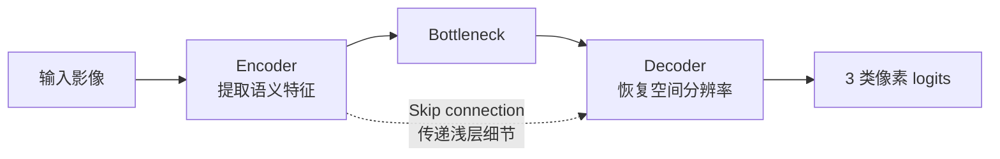
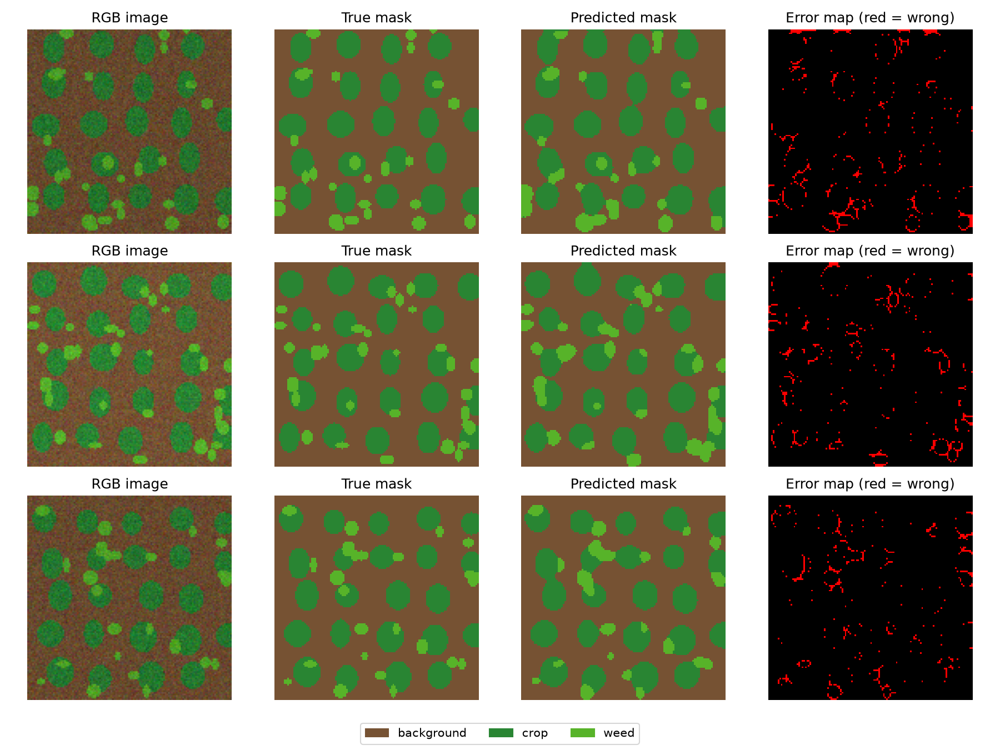
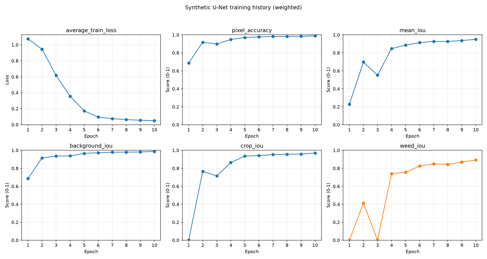
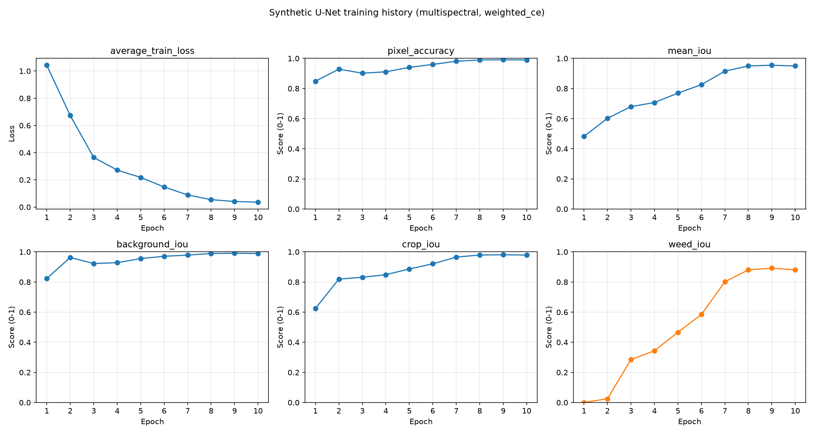
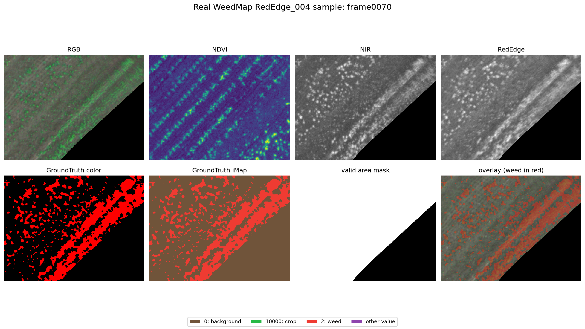
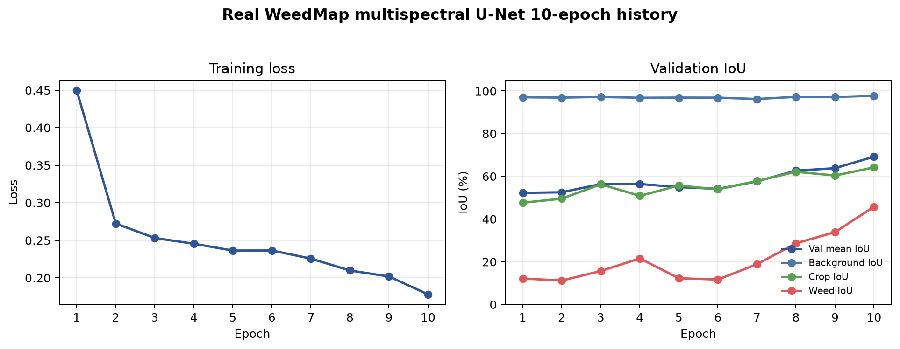
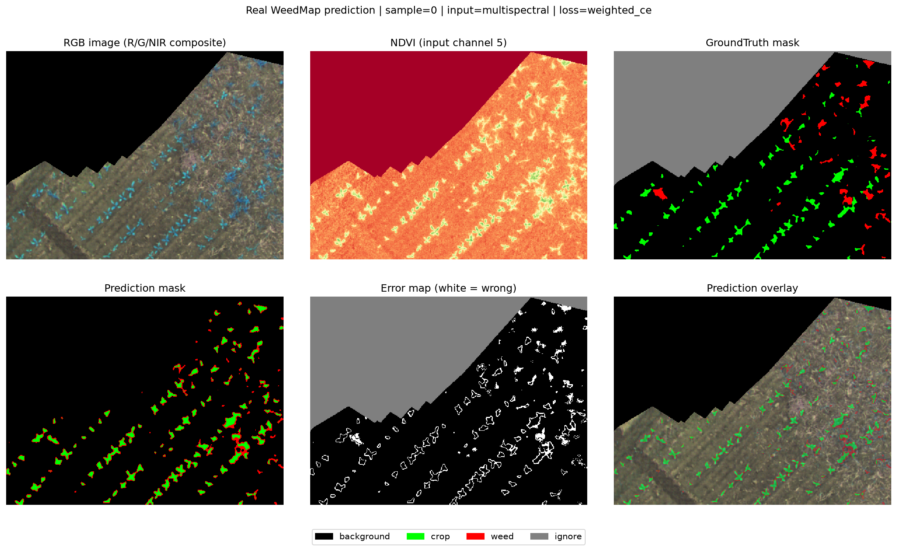
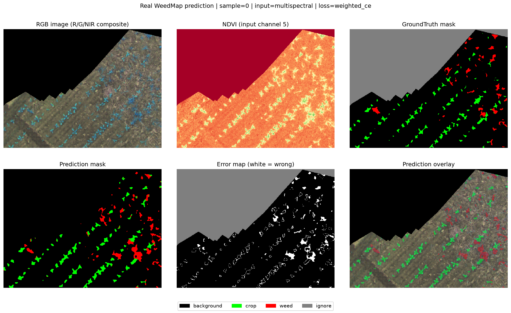

# 基于无人机多光谱影像的作物、杂草、土壤/背景区分实验进度报告

**项目：** cv-weedmap-segmentation  
**当前阶段：** Synthetic 与真实 WeedMap 基线、loss 对比、边界分析、MobileNetV2ShallowUNet 方案 A 及其 boundary weighted CE r5_w4 三 seed 实验完成；已统计 common split 的 VCR 用于路线选择

---

## 1. 项目背景与研究目标

本项目面向无人机农业遥感场景，目标是综合利用影像中的**空间纹理信息**与**多光谱/植被指数信息**，对实验田中的作物、杂草、土壤/背景进行像素级区分。

当前任务属于**语义分割**，而不是整张图片分类：

- 输入：无人机 RGB 图像或多光谱通道；
- 输出：每个像素的类别；
- 类别：`background`、`crop`、`weed`。

该目标与导师课题中实验田作物、杂草和土壤区分的研究方向一致。现阶段先利用 WeedMap 公共数据与 synthetic 数据跑通数据处理、训练、评价和可视化流程，后续可迁移至水稻田或柑橘田数据，并根据实际传感器波段与标注体系进行适配。

## 2. 整体实验路线


总体策略是先在可控的模拟数据上验证方法，再进入真实数据，以降低数据格式、标签映射、类别不平衡和模型训练等问题相互耦合带来的排查难度。

## 3. 光谱指数模拟实验

为了理解多光谱数据为何有助于区分作物、杂草和土壤，首先对三类地物的典型光谱反射率与植被指数进行了模拟。

| Class | Green | Red | RedEdge | NIR | NDVI | NDRE |
| --- | ---: | ---: | ---: | ---: | ---: | ---: |
| crop | 0.1200 | 0.0501 | 0.2398 | 0.5500 | 0.8332 | 0.3928 |
| weed | 0.1401 | 0.0701 | 0.2800 | 0.5099 | 0.7587 | 0.2912 |
| soil | 0.2000 | 0.2301 | 0.2600 | 0.2899 | 0.1151 | 0.0544 |

变量含义如下：

- **Green**：绿光波段反射率；
- **Red**：红光波段反射率；
- **RedEdge**：红边波段，常用于植被状态分析；
- **NIR**：近红外波段，健康植被通常具有较强反射；
- **NDVI**：基于 Red 与 NIR 计算的归一化植被指数；
- **NDRE**：基于 RedEdge 与 NIR 计算的归一化红边指数。

结果表明，crop 和 weed 都属于植物，因此 NDVI 均较高；soil 的 NDVI 和 NDRE 明显较低，因而土壤与植被相对容易区分。**真正困难的是 crop 与 weed 的区分：二者都具有植被光谱特征，需要进一步结合更多波段、纹理、形状和空间上下文。**

## 4. 光谱阈值 baseline 实验

采用如下可解释规则建立阈值基线：

- `NDVI < 0.4` → soil；
- `NDVI >= 0.4` 且 `NDRE >= 0.35` → crop；
- `NDVI >= 0.4` 且 `NDRE < 0.35` → weed。

| 指标 | 结果 |
| --- | ---: |
| Overall accuracy | 99.84% |
| Crop accuracy | 99.66% |
| Weed accuracy | 100.00% |
| Soil accuracy | 100.00% |

该 baseline 的意义是提供一种**简单、可解释、可复现**的参照，而非追求最强效果。由于数据是按照具有明显光谱差异的模拟分布生成，指标不能直接代表真实田间效果；后续深度学习实验应以更复杂的真实场景为准。

## 5. Synthetic 语义分割实验设计

在真实数据训练前，先用 synthetic 数据模拟实验田，以跑通“数据生成—Dataset—模型训练—指标评价—预测可视化”的完整语义分割流程：

- background 模拟土壤背景；
- crop 模拟规则排列的作物行；
- weed 模拟随机分布的小目标杂草；
- 加入噪声模拟无人机航拍与光照变化；
- 支持 RGB 和 multispectral 两类输入。

模型采用小型 U-Net，输入为 RGB 或多光谱张量，输出为 3 类 logits，分别对应 background、crop 和 weed。



- **Encoder**：逐步压缩空间尺度并提取高级语义特征；
- **Decoder**：逐步恢复空间分辨率，输出像素级预测；
- **Skip connection**：将浅层的边缘与定位细节传给解码器，有助于恢复边界和分割小目标。



*图 1：Synthetic 样本的输入、真实标签、预测标签与误差区域，用于验证完整分割和可视化流程。*

## 6. Synthetic baseline 结果

普通 `CrossEntropyLoss`（5 epochs）的结果如下：

| Pixel Accuracy | Mean IoU | Background IoU | Crop IoU | Weed IoU |
| ---: | ---: | ---: | ---: | ---: |
| 93.16% | 59.31% | 98.09% | 79.59% | 0.26% |

虽然 pixel accuracy 达到 93.16%，但 weed IoU 仅为 0.26%。这说明模型主要学会了占比较大的 background 和较明显的 crop，却几乎忽视少数类 weed。**高 pixel accuracy 并不等于三个类别都分得好，这一结果直接反映出类别不平衡问题。**

## 7. Class weights 改进实验

为增强模型对少数类的关注，将 weighted CrossEntropyLoss 的类别权重设置为：

| 类别 | Background | Crop | Weed |
| --- | ---: | ---: | ---: |
| 权重 | 1.0 | 2.0 | 6.0 |

5 epochs 结果如下：

| Pixel Accuracy | Mean IoU | Background IoU | Crop IoU | Weed IoU |
| ---: | ---: | ---: | ---: | ---: |
| 97.05% | 88.57% | 96.55% | 93.60% | 75.54% |

class weights 通过提高 weed 预测错误的损失权重，使优化过程更重视少数类。**Weed IoU 从 0.26% 提升到 75.54%，表明类别权重能有效缓解当前 synthetic 数据中的类别不平衡。**



*图 2：Synthetic weighted CE 训练历史，可观察 loss 下降及各类别 IoU 的变化。*

## 8. Synthetic 10 epochs 稳定性实验

Weighted CE 训练至 10 epochs 后的结果为：

| Train Loss | Pixel Accuracy | Mean IoU | Background IoU | Crop IoU | Weed IoU |
| ---: | ---: | ---: | ---: | ---: | ---: |
| 0.0501 | 98.85% | 94.99% | 98.79% | 96.98% | 89.19% |

训练前期 weed IoU 波动较大，随后逐渐稳定。这说明少数类 weed 的有效样本更少、形态更零散，通常需要更多轮次才能学到稳定特征。

## 9. Loss Function 对比实验

保持主要训练设置一致，对四种损失函数进行比较：

| Loss | Pixel Acc | Mean IoU | Background IoU | Crop IoU | Weed IoU |
| --- | ---: | ---: | ---: | ---: | ---: |
| CE | 98.04% | 89.71% | 98.66% | 94.34% | 76.14% |
| **Weighted CE** | **98.85%** | **94.99%** | **98.79%** | **96.98%** | **89.19%** |
| Dice | 97.23% | 85.51% | 98.64% | 91.62% | 66.27% |
| Focal | 98.00% | 91.16% | 98.18% | 94.00% | 81.30% |

- **CE**：普通交叉熵，进行逐像素多分类；
- **Weighted CE**：在 CE 中加入类别权重，提高少数类错误的代价；
- **Dice Loss**：更关注预测区域和真实区域的重叠；
- **Focal Loss**：降低容易分类样本的贡献，更关注难分类样本。

**在当前 synthetic 设置下，Weighted CE 整体最好，Focal Loss 次之。** 这也说明具体 loss 的效果依赖数据分布，仍需在真实 WeedMap 数据上复验。

## 10. Synthetic RGB vs Multispectral 对比

| 输入与设置 | Train Loss | Pixel Acc | Mean IoU | Background IoU | Crop IoU | Weed IoU |
| --- | ---: | ---: | ---: | ---: | ---: | ---: |
| RGB + weighted CE + 10 epochs | 0.0501 | 98.85% | 94.99% | 98.79% | 96.98% | **89.19%** |
| Multispectral + weighted CE + 10 epochs | **0.0360** | **98.97%** | 94.97% | **98.95%** | **97.90%** | 88.07% |



*图 3：Synthetic multispectral + weighted CE 的训练历史，用于与 RGB 输入实验对照。*

在 synthetic 数据中，多光谱输入没有在 mean IoU 和 weed IoU 上明显超过 RGB。可能原因是模拟数据中的 RGB 颜色差异已经较明显，额外光谱通道带来的信息增益有限。**该结果不代表真实数据中多光谱无效；真实无人机影像受到土壤、光照、遮挡和生长状态等因素影响，仍需通过真实对照实验验证。**

## 11. 真实 WeedMap 数据读取与结构检查

项目已经进入真实数据阶段，已完成 WeedMap Tiles 的下载解压与结构检查：

- 提取 `RedEdge_000` 至 `RedEdge_004`；
- 提取 `Sequoia_005` 至 `Sequoia_007`；
- 每张 tile 尺寸为 360 × 480；
- 共统计 1670 个候选样本；
- Dataset 构建后，RGB 模式加载 454 个样本，多光谱模式加载 884 个样本。

真实数据的主要目录包括：

```text
tile/RGB    tile/CIR    tile/B      tile/G
tile/R      tile/RE     tile/NIR    tile/NDVI
groundtruth mask
```



*图 4：真实 WeedMap 样本的 RGB、NDVI、NIR、RedEdge、GroundTruth、mask 与 overlay；结果表明 UAV 多光谱影像、标签和有效区掩膜能够正确读取并空间对齐。*

## 12. 真实 WeedMap 标签映射验证

本地逐像素验证得到如下映射：

| 数据源 | 数值/颜色 | 含义 |
| --- | --- | --- |
| GroundTruth_color | black | background |
| GroundTruth_color | green | crop |
| GroundTruth_color | red | weed |
| GroundTruth_iMap | 0 | background |
| GroundTruth_iMap | 10000 | crop |
| GroundTruth_iMap | 2 | weed |
| mask | 0 | valid area |
| mask | 255 | invalid / no-data area |

因此，训练时不能将 iMap 中的 `10000` 直接误判为 ignore。当前采用更稳妥的方式：从 `GroundTruth_color` 生成训练标签，将 black、green、red 分别映射为 0、1、2，并把 `mask=255` 的区域设置为 `ignore_index=255`。

**标签语义与无效区域必须分开处理，否则会把 crop 错误忽略，直接破坏训练与评价。**

## 13. 真实 WeedMap PyTorch Dataset

项目已实现 `weedmap_dataset.py`，支持两类输入：

- `rgb`：读取 `tile/RGB`，输出 3 通道；
- `multispectral`：读取 `tile/G`、`tile/R`、`tile/RE`、`tile/NIR`、`tile/NDVI`，输出 5 通道。

Dataset 输出定义为：

- `image`：`torch.float32`，形状 `[C,H,W]`，归一化到 0～1；
- `label`：`torch.long`，形状 `[H,W]`；
- 标签取值：0=background、1=crop、2=weed、255=ignore。

过滤规则包括：跳过缺失必要文件的样本、全黑图像、标签全为 ignore 的样本，以及有效像素过少的样本。

| Dataset | Loaded | Skipped missing | Skipped empty/invalid |
| --- | ---: | ---: | ---: |
| RGB | 454 | 700 | 516 |
| Multispectral | 884 | 0 | 786 |

第一个有效样本检查结果：

| 检查项 | 结果 |
| --- | ---: |
| Image max | > 0 |
| Label unique values | [0, 1, 2, 255] |
| Background pixels | 104834 |
| Crop pixels | 4568 |
| Weed pixels | 2756 |
| Ignore pixels | 60642 |

像素统计进一步说明真实数据存在明显类别不平衡：background 远多于 crop 和 weed，而 weed 又少于 crop。

## 14. 真实 WeedMap U-Net 训练实验

项目已实现 `train_real_weedmap_unet.py`。首轮真实数据训练设置如下：

| 参数 | 设置 |
| --- | --- |
| Input type | multispectral（5 通道） |
| Loss | weighted CE |
| Epochs | 3 |
| Batch size | 2 |
| Learning rate | 0.001 |
| Optimizer | Adam |
| Train / validation | 707 / 177 samples |
| Ignore index | 255 |
| Class weights | background=1.0, crop=4.0, weed=8.0 |

参数解释：`epochs` 是完整遍历训练集的轮数；`batch_size` 是每次送入模型的样本数；`lr` 控制每次参数更新步长；`weighted_ce` 是带类别权重的交叉熵；`ignore_index=255` 使无效区域不参与 loss 和指标；class weights 则提高 crop，尤其是 weed 错分时的惩罚。

3 epochs 的 train loss 依次为 `0.4497 → 0.2724 → 0.2532`，验证集结果为：

| Val Pixel Acc | Mean IoU | Background IoU | Crop IoU | Weed IoU |
| ---: | ---: | ---: | ---: | ---: |
| 95.61% | 56.37% | 97.15% | 56.28% | 15.68% |

loss 持续下降，说明模型能够正常学习；background IoU 很高，crop 已有初步效果，但 weed IoU 较低，说明真实杂草比模拟数据更难识别。

## 15. 真实 WeedMap 10 epochs 稳定性实验

| Epoch | Train Loss | Val Pixel Acc | Mean IoU | Background IoU | Crop IoU | Weed IoU |
| ---: | ---: | ---: | ---: | ---: | ---: | ---: |
| 1 | 0.4497 | 95.38% | 52.28% | 96.99% | 47.65% | 12.18% |
| 2 | 0.2724 | 95.25% | 52.53% | 96.84% | 49.52% | 11.24% |
| 3 | 0.2532 | 95.61% | 56.37% | 97.15% | 56.28% | 15.68% |
| 4 | 0.2455 | 95.12% | 56.41% | 96.76% | 50.87% | 21.59% |
| 5 | 0.2364 | 95.52% | 54.94% | 96.83% | 55.68% | 12.31% |
| 6 | 0.2365 | 95.50% | 54.14% | 96.81% | 53.91% | 11.70% |
| 7 | 0.2257 | 95.07% | 57.62% | 96.18% | 57.81% | 18.86% |
| 8 | 0.2099 | 96.40% | 62.65% | 97.17% | 62.13% | 28.66% |
| 9 | 0.2019 | 96.29% | 63.80% | 97.14% | 60.38% | 33.90% |
| 10 | **0.1781** | **97.22%** | **69.21%** | **97.69%** | **64.17%** | **45.76%** |



*图 5：真实 WeedMap 多光谱 U-Net 的 train loss 与验证集 mean/background/crop/weed IoU；Epoch 8 后 weed IoU 提升明显。*

3 epochs 与 10 epochs 对比如下：

| Setting | Val Pixel Acc | Mean IoU | Background IoU | Crop IoU | Weed IoU |
| --- | ---: | ---: | ---: | ---: | ---: |
| 3 epochs | 95.61% | 56.37% | 97.15% | 56.28% | 15.68% |
| **10 epochs** | **97.22%** | **69.21%** | **97.69%** | **64.17%** | **45.76%** |

训练延长后，weed IoU 从 15.68% 提升至 45.76%，mean IoU 从 56.37% 提升至 69.21%。**增加训练轮数对真实 WeedMap 的 weed 类非常有效，且 Epoch 8～10 的明显提升表明 weed 类学习速度较慢。** 同时，中间轮次仍有波动，后续需通过更长训练与多 seed 实验判断稳定性。

## 16. 严格公平 RGB vs Multispectral 对比实验

### 实验设置

- `sample_list_csv=splits/real_weedmap_common_samples.csv`；
- RGB 和 Multispectral 使用完全相同的 454 个样本；
- train samples：363；
- val samples：91；
- `input_type` 分别为 `rgb` 和 `multispectral`；
- `loss=weighted_ce`；
- `epochs=10`；
- `batch_size=2`；
- class weights：`background=1.0`、`crop=4.0`、`weed=8.0`；
- `ignore_index=255`。

两种输入使用同一个 sample list、相同样本数和相同训练/验证划分，因此这次对比比之前样本集合不同的实验更公平，可以更可靠地比较输入通道带来的差异。

### 实验结果

| Input | Train Loss | Val Pixel Acc | Mean IoU | Background IoU | Crop IoU | Weed IoU |
|---|---:|---:|---:|---:|---:|---:|
| RGB | 0.2956 | 94.28% | 65.27% | 95.49% | 65.75% | 34.56% |
| Multispectral | 0.2166 | 94.38% | 67.76% | 94.94% | 61.62% | 46.73% |

Multispectral 的 mean IoU 为 67.76%，高于 RGB 的 65.27%，说明其整体分割效果略好。Multispectral 的 weed IoU 达到 46.73%，比 RGB 的 34.56% 高 12.17 个百分点，说明多光谱通道对杂草识别更有帮助。RGB 的 crop IoU 为 65.75%，比 Multispectral 的 61.62% 高 4.13 个百分点，说明 RGB 对作物行状结构也有一定优势。对导师课题而言，weed 是关键难点，因此多光谱方向更值得继续深入。

Multispectral 在 Epoch 8 达到更好结果：mean IoU 为 70.38%，weed IoU 为 50.43%；Epoch 10 的 mean IoU 为 67.76%，weed IoU 为 46.73%。这说明训练后期存在波动，应根据验证集 mean IoU 保存并优先使用 best checkpoint。

## 17. Best checkpoint 验证结果

在严格公平 multispectral 实验中，训练脚本已经支持根据 val mean IoU 保存 best checkpoint。

### 整体验证集结果

- best epoch = 8
- best val mean IoU = 70.38%
- best background IoU = 96.09%
- best crop IoU = 64.61%
- best weed IoU = 50.43%
- best model path = `models/real_weedmap_common_multispectral_weighted_ce_10epochs_best.pth`

与最后一轮 Epoch 10 对比：

- Epoch 10 val mean IoU = 67.76%
- Epoch 10 weed IoU = 46.73%
- best Epoch 8 val mean IoU = 70.38%
- best Epoch 8 weed IoU = 50.43%

这组结果说明：

1. 真实 WeedMap 训练后期存在波动。
2. 最后一轮模型不一定是最优模型。
3. 保存 best checkpoint 可以避免因为后期波动导致最终模型性能下降。
4. 后续实验应优先报告 best checkpoint 的结果。

### 单张 sample index=0 预测可视化结果

| Model | Pixel Acc | Mean IoU | Background IoU | Crop IoU | Weed IoU |
|---|---:|---:|---:|---:|---:|
| Epoch 10 final | 92.63% | 57.12% | 93.41% | 48.42% | 29.53% |
| Best checkpoint | 94.19% | 60.77% | 94.96% | 53.49% | 33.85% |

best checkpoint 在验证集整体指标和单张预测可视化指标上都优于最后一轮模型，因此后续真实 WeedMap 实验应保存并使用 best checkpoint。

## 18. Weed class weight 调参实验

### 实验设置

- `sample_list_csv=splits/real_weedmap_common_samples.csv`；
- `input_type=multispectral`；
- 在 RGB 和 multispectral 严格公平对比后，继续使用 multispectral 调参；
- `loss=weighted_ce`；
- `epochs=10`；
- `batch_size=2`；
- train samples：363；
- val samples：91；
- class weights：`background=1.0`、`crop=4.0`，weed 分别设为 8、12、16；
- `ignore_index=255`；
- 使用 best checkpoint，并根据验证集 mean IoU 保存最佳模型。

### 实验结果

| Weed Weight | Best Epoch | Best Mean IoU | Background IoU | Crop IoU | Weed IoU |
|---:|---:|---:|---:|---:|---:|
| 8 | 8 | 70.38% | 96.09% | 64.61% | 50.43% |
| 12 | 8 | 69.64% | 95.25% | 64.63% | 49.04% |
| 16 | 8 | 67.98% | 94.72% | 62.88% | 46.36% |

### 结果解释

1. `weed weight=8` 当前效果最好，best mean IoU 和 weed IoU 均为三组实验中的最高值。
2. `weed weight=12` 与 8 的结果接近，但 best mean IoU 和 weed IoU 略低。
3. 当 `weed weight=16` 时，mean IoU 和 weed IoU 均进一步下降。
4. 结果说明 weed 权重并非越大越好；过大的 weed 权重可能破坏 background、crop、weed 三类之间的平衡。
5. 当前后续实验可继续使用 `background=1.0`、`crop=4.0`、`weed=8.0` 作为默认 weighted CE 设置。
6. 若继续细化权重，可尝试 `weed weight=10`；也可改用 Focal Loss 或 Dice + CE，比较不同类别不平衡处理方法。

## 19. 20 epochs 训练实验

### 实验设置

- `sample_list_csv=splits/real_weedmap_common_samples.csv`；
- `input_type=multispectral`；
- `loss=weighted_ce`；
- class weights：`background=1.0`、`crop=4.0`、`weed=8.0`；
- `epochs=20`；
- `batch_size=2`；
- train samples：363；
- val samples：91；
- `ignore_index=255`；
- 使用 best checkpoint，根据 val mean IoU 保存最佳模型。

### 验证集整体结果

| Setting | Best Epoch | Pixel Acc | Mean IoU | Background IoU | Crop IoU | Weed IoU |
|---|---:|---:|---:|---:|---:|---:|
| 10 epochs best | 8 | 95.47% | 70.38% | 96.09% | 64.61% | 50.43% |
| 20 epochs best | 15 | 95.97% | 73.88% | 96.20% | 70.89% | 54.54% |

20 epochs best checkpoint 明显优于 10 epochs best checkpoint：mean IoU 从 70.38% 提升到 73.88%，weed IoU 从 50.43% 提升到 54.54%，crop IoU 从 64.61% 提升到 70.89%。这说明在真实 WeedMap 上继续训练到 20 epochs 是有效的。

但 Epoch 15 之后指标仍有波动。例如，Epoch 20 的 mean IoU 降到 69.52%，weed IoU 降到 46.82%，因此 best checkpoint 机制仍然必要。

### 单张 sample index=0 可视化结果

| Model | Pixel Acc | Mean IoU | Background IoU | Crop IoU | Weed IoU |
|---|---:|---:|---:|---:|---:|
| 10 epochs best | 94.19% | 60.77% | 94.96% | 53.49% | 33.85% |
| 20 epochs best | 94.82% | 63.90% | 95.32% | 59.39% | 36.99% |

单张预测可视化上，20 epochs best 同样优于 10 epochs best。错误仍主要集中在 crop/weed 边界、小目标 weed 以及植物混杂区域。后续可以继续尝试更长训练，例如 30 epochs，但必须使用 best checkpoint。20 epochs 的多 seed 重复结果见下节。

## 20. SmallUNet baseline：20 epochs 多 seed 重复实验

### 实验设置

- `sample_list_csv=splits/real_weedmap_common_samples.csv`；
- `input_type=multispectral`；
- `loss=weighted_ce`；
- class weights：`background=1.0`、`crop=4.0`、`weed=8.0`；
- `epochs=20`；
- `batch_size=2`；
- train samples：363；
- val samples：91；
- `ignore_index=255`；
- seeds：`0`、`1`、`2`；
- 使用 best checkpoint，根据 val mean IoU 保存最佳模型。

### 各 seed 的 best checkpoint 验证集结果

| Seed | Best Epoch | Pixel Acc | Mean IoU | Background IoU | Crop IoU | Weed IoU |
|---:|---:|---:|---:|---:|---:|---:|
| 0 | 15 | 95.97% | 73.88% | 96.20% | 70.89% | 54.54% |
| 1 | 15 | 96.51% | 74.99% | 96.96% | 69.59% | 58.44% |
| 2 | 15 | 96.65% | 75.47% | 96.94% | 71.80% | 57.68% |

### 多 seed 均值与样本标准差

| Metric | Mean ± Std |
|---|---:|
| Pixel Accuracy | 96.38% ± 0.36% |
| Mean IoU | 74.78% ± 0.82% |
| Background IoU | 96.70% ± 0.43% |
| Crop IoU | 70.76% ± 1.11% |
| Weed IoU | 56.89% ± 2.06% |

三个 seed 的 best epoch 均为 Epoch 15，说明当前设置在 20 epochs 内的最佳轮次比较稳定。三个 seed 的 mean IoU 位于 73.88%～75.47%，波动较小；weed IoU 均超过 54%，明显高于 10 epochs best 的 50.43%。多 seed 平均 weed IoU 为 56.89% ± 2.06%，支持 20 epochs 的提升不是偶然的单次结果。当前可将 `multispectral + weighted CE + class weights 1/4/8 + 20 epochs + best checkpoint` 作为后续 baseline。

## 21. Loss 多 seed 对比实验

### 实验设置

- `sample_list_csv=splits/real_weedmap_common_samples.csv`；
- `input_type=multispectral`；
- `epochs=20`，`batch_size=2`；
- train samples：363；val samples：91；
- `ignore_index=255`；
- seeds：`0`、`1`、`2`；
- 使用 best checkpoint，根据 val mean IoU 保存最佳模型；
- 对比 Weighted CE（`background=1.0`、`crop=4.0`、`weed=8.0`）、Focal Loss、Dice + CE。Weighted CE 各 seed 明细见第 20 节 SmallUNet baseline。

### Focal Loss：各 seed 的 best checkpoint 验证集结果

| Seed | Best Epoch | Pixel Acc | Mean IoU | Background IoU | Crop IoU | Weed IoU |
|---:|---:|---:|---:|---:|---:|---:|
| 0 | 20 | 96.59% | 74.72% | 97.09% | 69.55% | 57.52% |
| 1 | 19 | 96.51% | 72.56% | 97.17% | 66.14% | 54.36% |
| 2 | 19 | 96.99% | 74.73% | 97.30% | 72.12% | 54.77% |

### Dice + CE：各 seed 的 best checkpoint 验证集结果

| Seed | Best Epoch | Pixel Acc | Mean IoU | Background IoU | Crop IoU | Weed IoU |
|---:|---:|---:|---:|---:|---:|---:|
| 0 | 18 | 96.81% | 76.35% | 97.17% | 72.07% | 59.82% |
| 1 | 19 | 96.92% | 76.44% | 97.26% | 71.39% | 60.67% |
| 2 | 16 | 96.46% | 70.56% | 97.20% | 65.14% | 49.35% |

### 三种 loss 的均值与样本标准差

| Loss | Pixel Acc | Mean IoU | Background IoU | Crop IoU | Weed IoU |
|---|---:|---:|---:|---:|---:|
| Weighted CE | 96.38% ± 0.36% | 74.78% ± 0.82% | 96.70% ± 0.43% | 70.76% ± 1.11% | 56.89% ± 2.06% |
| Focal Loss | 96.69% ± 0.26% | 74.00% ± 1.25% | 97.19% ± 0.11% | 69.27% ± 3.00% | 55.55% ± 1.72% |
| Dice + CE | 96.73% ± 0.24% | 74.45% ± 3.37% | 97.21% ± 0.05% | 69.54% ± 3.82% | 56.61% ± 6.31% |

Weighted CE 的平均 mean IoU 最高，为 74.78% ± 0.82%；平均 weed IoU 也最高，为 56.89% ± 2.06%。Focal Loss 的 background IoU 较高，weed IoU 的跨 seed 波动也较小，但平均 weed IoU 略低于 Weighted CE。Dice + CE 在 seed=0 和 seed=1 上表现很强，seed=2 的 mean IoU 和 weed IoU 明显下降，因此样本标准差较大。当前阶段最稳的主 baseline 仍是 `multispectral + weighted CE + class weights 1/4/8 + 20 epochs + best checkpoint`。Dice + CE 有后续探索价值，需要进一步调参或增加 seed 验证稳定性。

## 22. Boundary error analysis

### 问题观察与结构检查

预测可视化显示，错误主要集中在 crop/weed 轮廓附近，Error map 中有许多白色边界圈。检查当前 `unet.py`：模型已有 encoder-decoder skip connection，使用 `torch.cat(..., dim=1)` 进行 concat，而非 add。因此问题并非缺少 skip connection，而是当前普通 U-Net 的边界精细化能力仍然不足。

### Boundary error analysis：Weighted CE 20 epochs best，sample index=0

| 统计项 | 结果 |
|---|---:|
| Total valid pixels | 112158 |
| Total error pixels | 5812 |
| Overall error rate | 5.18% |
| Errors within 1px boundary | 4504（占错误 77.49%） |
| Errors within 3px boundary | 5372（占错误 92.43%） |
| Errors within 5px boundary | 5532（占错误 95.18%） |
| Errors outside 5px boundary | 280（占错误 4.82%） |
| Valid pixels within 5px boundary | 38199（占有效像素 34.06%） |
| Error rate within 5px boundary | 14.48% |
| Error rate outside 5px boundary | 0.38% |

5px 边界区域仅占有效像素的 34.06%，却包含 95.18% 的错误像素；该区域错误率为 14.48%，远高于非边界区域的 0.38%。当前模型的主要瓶颈集中在边界区域，而非大面积内部区域。

## 23. SmallUNet + boundary weighted CE r5_w4

以下保留 r5_w3 对照，再记录 r5_w4 调参结果。

### Boundary weighted CE 实验设置与三 seed 结果（r5_w3）

- `loss=boundary_weighted_ce`，`boundary radius=5`，`boundary weight=3.0`；
- `input_type=multispectral`，`epochs=20`，`batch_size=2`；
- `sample_list_csv=splits/real_weedmap_common_samples.csv`；
- 使用 best checkpoint。

| Seed | Best Epoch | Pixel Acc | Mean IoU | Background IoU | Crop IoU | Weed IoU |
|---:|---:|---:|---:|---:|---:|---:|
| 0 | 20 | 96.71% | 75.95% | 97.10% | 71.66% | 59.09% |
| 1 | 16 | 96.73% | 73.84% | 97.15% | 68.42% | 55.97% |
| 2 | 18 | 97.04% | 75.43% | 97.33% | 71.06% | 57.92% |

三 seed 均值 ± 样本标准差：

| Metric | Mean ± Std |
|---|---:|
| Pixel Accuracy | 96.83% ± 0.19% |
| Mean IoU | 75.08% ± 1.10% |
| Background IoU | 97.19% ± 0.12% |
| Crop IoU | 70.38% ± 1.73% |
| Weed IoU | 57.66% ± 1.58% |

与原 Weighted CE 的三 seed 结果对比（均值 ± 样本标准差）：

| Loss | Pixel Acc | Mean IoU | Background IoU | Crop IoU | Weed IoU |
|---|---:|---:|---:|---:|---:|
| Weighted CE | 96.38% ± 0.36% | 74.78% ± 0.82% | 96.70% ± 0.43% | 70.76% ± 1.11% | 56.89% ± 2.06% |
| Boundary weighted CE（r5_w3） | 96.83% ± 0.19% | 75.08% ± 1.10% | 97.19% ± 0.12% | 70.38% ± 1.73% | 57.66% ± 1.58% |

### Boundary weight=4.0 三 seed 调参结果（r5_w4）

保持 `input_type=multispectral`、`loss=boundary_weighted_ce`、`boundary_radius=5`、`epochs=20`，按验证集 mean IoU 选择 best checkpoint；将 `boundary_weight` 调至 4.0。

| Seed | Best Epoch | Pixel Acc | Mean IoU | Background IoU | Crop IoU | Weed IoU |
|---:|---:|---:|---:|---:|---:|---:|
| 0 | 20 | 96.67% | 75.74% | 97.04% | 70.89% | 59.28% |
| 1 | 16 | 96.73% | 73.99% | 97.14% | 67.37% | 57.45% |
| 2 | 16 | 96.97% | 75.78% | 97.26% | 71.97% | 58.13% |

三 seed 均值 ± 样本标准差：

| Metric | Mean ± Std |
|---|---:|
| Pixel Accuracy | 96.79% ± 0.16% |
| Mean IoU | 75.17% ± 1.02% |
| Background IoU | 97.15% ± 0.11% |
| Crop IoU | 70.07% ± 2.41% |
| Weed IoU | 58.29% ± 0.92% |

与 r5_w3 对比（三 seed 均值 ± 样本标准差）：

| 实验 | Mean IoU | Weed IoU |
|---|---:|---:|
| r5_w3（boundary weight=3.0） | 75.08% ± 1.10% | 57.66% ± 1.58% |
| r5_w4（boundary weight=4.0） | 75.17% ± 1.02% | 58.29% ± 0.92% |

r5_w4 的 mean IoU 平均提高 0.09 个百分点，weed IoU 平均提高 0.63 个百分点，且 weed IoU 的跨 seed 样本标准差从 1.58 降至 0.92 个百分点。提升幅度较小，主要体现在 weed IoU 更高、更稳定。在 `SmallUNet` 的 boundary loss 调参中，较优候选为 `multispectral + boundary_weighted_ce + boundary_radius=5 + boundary_weight=4.0 + 20 epochs + best checkpoint`。

### Sample index=0 的预测与边界错误对比（r5_w3）

| Model | Pixel Acc | Mean IoU | Background IoU | Crop IoU | Weed IoU |
|---|---:|---:|---:|---:|---:|
| Weighted CE 20 epochs best | 94.82% | 63.90% | 95.32% | 59.39% | 36.99% |
| Boundary weighted CE | 96.66% | 68.86% | 97.34% | 66.02% | 43.22% |

Boundary weighted CE 后的 sample index=0 边界错误统计：

| 统计项 | 结果 |
|---|---:|
| Total valid pixels | 112158 |
| Total error pixels | 3746 |
| Overall error rate | 3.34% |
| Errors within 1px boundary | 3155（占错误 84.22%） |
| Errors within 3px boundary | 3580（占错误 95.57%） |
| Errors within 5px boundary | 3630（占错误 96.90%） |
| Errors outside 5px boundary | 116（占错误 3.10%） |
| Valid pixels within 5px boundary | 38199（占有效像素 34.06%） |
| Error rate within 5px boundary | 9.50% |
| Error rate outside 5px boundary | 0.16% |

Sample index=0 的 total error pixels 从 5812 降至 3746，overall error rate 从 5.18% 降至 3.34%；5px boundary error rate 从 14.48% 降至 9.50%，outside 5px error rate 从 0.38% 降至 0.16%。绝对错误数表明 boundary-aware loss 减少了边界附近错误；剩余错误的边界占比仍高，说明边界仍是后续优化重点。

阶段性结论：boundary weighted CE 相比原 Weighted CE 有小幅提升；在 `SmallUNet` 的 boundary weight 调参中，r5_w4 相比 r5_w3 的 weed IoU 更高、更稳定，可作为该组实验的候选结果。继续保留 Weighted CE 作为稳定 baseline。

## 24. MobileNetV2ShallowUNet 方案 A 正式实验

### 方案定位、结构与参数量

`MobileNetV2ShallowUNet` 是方案 A：保留当前 `SmallUNet` 的 C1/C2、两级 Decoder、skip connection 和 segmentation head，以浅层 MobileNetV2-style inverted residual blocks B1～B6 替换原 `enc2` 与 bottleneck。这是 MobileNetV2-style shallow encoder 改造实验，**不是论文完整 MobileNetV2-U-Net 复现**；完整 B1～B17 多尺度版本留作方案 B。

结构路径按高×宽×通道表示：`输入 360×480×5 → e1 360×480×16 → B3 180×240×24 → e2 adapter 24→32 → e2 180×240×32 → B6 90×120×32 → center adapter 32→64 → center 90×120×64`。

Decoder 保持：`center 90×120×64 → up2 180×240×32 → concat e2 180×240×64 → dec2 180×240×32 → up1 360×480×16 → concat e1 360×480×32 → dec1 360×480×16 → head 360×480×3`。

| 模型 | Total params |
| --- | ---: |
| SmallUNet | 117,363 |
| MobileNetV2ShallowUNet（方案 A） | 107,155 |

方案 A 减少 10,208 个参数，约 8.7%。原 `SmallUNet` 本身已很小，因此这里只能称为**轻微减少参数量**，不能称为大幅轻量化。

### 正式实验设置

- dataset：WeedMap common split（`splits/real_weedmap_common_samples.csv`）；
- input：multispectral（5 通道）；
- loss：`weighted_ce`；class weights：background 1.0、crop 4.0、weed 8.0；
- epochs：20；batch size：2；seeds：0、1、2；
- 按验证集 mean IoU 为每个 seed 选择 best checkpoint。

### 三 seed best checkpoint 验证集结果

| Seed | Best epoch | Pixel accuracy | Mean IoU | Background IoU | Crop IoU | Weed IoU |
| ---: | ---: | ---: | ---: | ---: | ---: | ---: |
| 0 | 15 | 96.04% | 74.86% | 96.31% | 71.21% | 57.04% |
| 1 | 14 | 96.57% | 75.51% | 96.92% | 69.29% | 60.30% |
| 2 | 20 | 96.98% | 77.22% | 97.17% | 74.73% | 59.75% |

### 三 seed 统计与 SmallUNet weighted CE baseline 对比

± 后为三 seed 的样本标准差；提升按两组均值相减，单位为百分点。

| 模型 / 差值 | Pixel accuracy | Mean IoU | Background IoU | Crop IoU | Weed IoU |
| --- | ---: | ---: | ---: | ---: | ---: |
| SmallUNet weighted CE | 96.38% ± 0.36% | 74.78% ± 0.82% | 96.70% ± 0.43% | 70.76% ± 1.11% | 56.89% ± 2.06% |
| MobileNetV2ShallowUNet 方案 A weighted CE | 96.53% ± 0.47% | 75.86% ± 1.22% | 96.80% ± 0.44% | 71.74% ± 2.76% | 59.03% ± 1.74% |
| 方案 A 相对提升（百分点） | +0.15 | +1.08 | +0.10 | +0.98 | +2.14 |

### seed2 best checkpoint 的 sample0 可视化结果

| Pixel accuracy | Background IoU | Crop IoU | Weed IoU | Mean IoU |
| ---: | ---: | ---: | ---: | ---: |
| 96.43% | 96.70% | 68.74% | 45.66% | 70.36% |

sample0 是单张样本，不能代替整体验证集或三 seed 统计。方案 A 在三组随机种子上整体优于原 `SmallUNet` weighted CE baseline，尤其提升 weed IoU，说明 MobileNetV2-style shallow encoder 对当前 WeedMap 多光谱语义分割任务有效。方案 B 后续可考虑完整 B1～B17 和更深的多尺度 Decoder。

## 25. MobileNetV2ShallowUNet + boundary weighted CE r5_w4

### 实验设置

- dataset：WeedMap common split（`splits/real_weedmap_common_samples.csv`）；input：multispectral；model：`MobileNetV2ShallowUNet`（方案 A）。
- loss：`boundary_weighted_ce`；boundary radius：5；boundary weight：4.0；class weights：background 1.0、crop 4.0、weed 8.0。
- epochs：20；batch size：2；seeds：0、1、2；按验证集 mean IoU 选择各 seed 的 best checkpoint。

### 三 seed best checkpoint 结果

| Seed | Best epoch | Pixel accuracy | Mean IoU | Background IoU | Crop IoU | Weed IoU |
| ---: | ---: | ---: | ---: | ---: | ---: | ---: |
| 0 | 20 | 96.91% | 76.97% | 97.20% | 73.41% | 60.30% |
| 1 | 12 | 96.78% | 76.08% | 97.15% | 71.02% | 60.07% |
| 2 | 18 | 97.25% | 77.07% | 97.44% | 74.69% | 59.10% |

### 三 seed 均值 ± 样本标准差及与前序主线对比

表中为三 seed 均值 ± 样本标准差；最后一行是相对 `SmallUNet + weighted CE` 的百分点提升。

| 模型 / 损失 | Pixel accuracy | Mean IoU | Background IoU | Crop IoU | Weed IoU |
| --- | ---: | ---: | ---: | ---: | ---: |
| SmallUNet / weighted CE | 96.38% ± 0.36% | 74.78% ± 0.82% | 96.70% ± 0.43% | 70.76% ± 1.11% | 56.89% ± 2.06% |
| SmallUNet / boundary weighted CE r5_w4 | 96.79% ± 0.16% | 75.17% ± 1.02% | 97.15% ± 0.11% | 70.07% ± 2.41% | 58.29% ± 0.92% |
| MobileNetV2ShallowUNet 方案 A / weighted CE | 96.53% ± 0.47% | 75.86% ± 1.22% | 96.80% ± 0.44% | 71.74% ± 2.76% | 59.03% ± 1.74% |
| MobileNetV2ShallowUNet 方案 A / boundary weighted CE r5_w4 | **96.98% ± 0.24%** | **76.71% ± 0.55%** | **97.26% ± 0.16%** | **73.04% ± 1.86%** | **59.82% ± 0.64%** |
| 相对 SmallUNet / weighted CE 提升（百分点） | +0.60 | +1.93 | +0.56 | +2.28 | +2.93 |

目前最强语义分割结果来自 MobileNetV2ShallowUNet + boundary weighted CE r5_w4，在三 seed 上达到 Mean IoU 76.71% ± 0.55%、Weed IoU 59.82% ± 0.64%。这说明浅层 MobileNetV2-style encoder 与 boundary-aware loss 可以叠加提升，尤其对 weed 类识别更有帮助。

### 主要模型预测结果可视化对比

在同一个 WeedMap common validation sample（seed 0，sample index=0）上，对比 RGB visualization、NDVI、Ground Truth、四个主要语义分割模型的 prediction 和对应 error map。下表是这张样本的指标，非整体验证集结果。

| 模型 / 损失 | Pixel accuracy | Mean IoU | Background IoU | Crop IoU | Weed IoU |
| --- | ---: | ---: | ---: | ---: | ---: |
| SmallUNet + weighted CE | 97.95% | 71.66% | 98.36% | 70.37% | 46.24% |
| SmallUNet + boundary CE r5_w4 | 97.80% | 68.20% | 98.25% | 56.38% | 49.96% |
| MobileNetV2ShallowUNet + weighted CE | 98.24% | 74.20% | 98.62% | 72.50% | 51.49% |
| MobileNetV2ShallowUNet + boundary CE r5_w4 | 98.21% | 74.45% | 98.38% | 63.04% | **61.92%** |


图片文件：`reports/assets/best_model_prediction_comparison_sample0.png`。

在 sample index=0 上，MobileNetV2ShallowUNet + boundary CE r5_w4 获得最高的 weed IoU，为 61.92%，说明该组合在该样本上对 weed 类识别更有帮助。MobileNetV2ShallowUNet + weighted CE 的 mean IoU 为 74.20%，MobileNetV2ShallowUNet + boundary CE r5_w4 的 mean IoU 为 74.45%，二者接近，但 boundary loss 明显提高了该样本上的 weed IoU。

这是单个 validation sample 的可视化对比，只用于定性展示和辅助解释；最终整体结论仍以三 seed 验证集平均结果为主。目前主结果为 MobileNetV2ShallowUNet + boundary weighted CE r5_w4：Mean IoU 76.71% ± 0.55%，Weed IoU 59.82% ± 0.64%。

## 26. VCR 植被覆盖率评判指标

`VCR = vegetation pixels / valid pixels`。vegetation pixels 为 `NDVI > 0.2` 且 `label != 255` 的像素；valid pixels 为 `label != 255` 的像素。VCR 是独立的场景评判指标，不与训练所得的 IoU 混用。

| 初始场景 | VCR 范围 | 样本数 | 占比 |
| --- | --- | ---: | ---: |
| sparse | VCR < 0.20 | 13 | 13 / 454 ≈ 2.86% |
| transition | 0.20 ≤ VCR ≤ 0.30 | 9 | 9 / 454 ≈ 1.98% |
| dense | VCR > 0.30 | 432 | 432 / 454 ≈ 95.15% |

WeedMap common split 共 454 张；VCR 均值 0.7928、中位数 0.9116、最小值 0.0000、最大值 0.9999。当前绝大多数样本属于高植被覆盖场景。阈值 0.20 / 0.30 是初始经验阈值，后续需要结合人工样本检查和实际除草需求进一步调整。

## 27. YOLO / U-Net 路线选择标准

无人机多光谱图像 → NDVI / 植物-土壤区分指标 → 计算 VCR → 判断 sparse / transition / dense。

| 场景 | 候选路线 | 用途 |
| --- | --- | --- |
| sparse | YOLO | 单株/单簇定位和点状精准除草 |
| dense | U-Net / MobileNetV2ShallowUNet | 区域 mask 和区域除草 |
| transition | 同时测试 YOLO 与 U-Net，或人工确认 | 根据目标形态选择 |

VCR 统计显示 WeedMap common split 以密集植被覆盖场景为主，因此当前阶段继续优化语义分割模型是合理的；YOLO 更适合作为低覆盖稀疏场景下的补充模型路线。YOLO 已完成 smoke test、5 epochs bbox 过滤对比和 weed-only vs crop+weed 对照，尚未与 U-Net 在相同条件下正式比较。

### YOLO 检测流程：数据集构建阶段与推理后处理阶段

**A. Detection Dataset 构建：** WeedMap semantic mask → target mask → connected components → component bbox → bbox statistics → visualization / statistical analysis → dataset bbox filtering rules → YOLO labels → Detection Dataset。

WeedMap 原始标签是 semantic segmentation mask，不包含 instance identity。connected component 只是从 mask 自动生成 bbox 的近似方法：稀疏场景的独立小型 component 更可能接近单株或单簇，但不能默认每个 component 就是一株 weed 或 crop；密集、粘连区域的大面积 component 可能包含多个植株或片状杂草区域，不宜解释为单株。此处 filtering 是**数据集构建阶段的 bbox 清洗**，用于生成较合理的 YOLO 训练标签。最终确定小框过滤阈值前，应统计 bbox width、height、area、aspect ratio、bbox/image area ratio 分布，并结合可视化检查；当前脚本的固定像素默认值未经这一步验证，不能视为最终规则，以免误删真实的小 weed。

**B. YOLO 训练 / 推理：** Detection Dataset → YOLOv8n smoke test / training → network candidate predictions → confidence filtering → NMS → final bounding boxes。

YOLO 网络输出候选框、类别和置信度。confidence filtering 去掉低置信度预测框，NMS 去掉高度重叠的重复预测框。两者是**模型推理阶段的预测框后处理**，不属于 backbone 或 U-Net / YOLO 特征提取网络，与 A 阶段的 bbox 清洗不同。当前 YOLOv8n 用于验证 mask → connected components → bbox → YOLO dataset → training/inference 流程及初步检测对照，不是论文 MobileNetV3-YOLOv3 复现。当前 YOLO baseline 暂时采用 crop+weed detection，weed-only 作为对照实验。common split 中 dense 占多数，当前主线仍是 U-Net / MobileNetV2ShallowUNet 语义分割；YOLO 是稀疏场景候选和辅助探索路线，暂不扩展复杂 sparse/dense routing 算法。

### YOLO bbox statistics before optimization

`python analyze_yolo_bbox_statistics.py` 对当前 YOLO 检测数据集进行优化前的标签质量分析，输出 `outputs/yolo_bbox_statistics.csv` 及 `reports/assets/` 下的 bbox 分布图。当前标签由 semantic mask 的 connected components 自动生成，并非人工 instance bbox。统计用于后续评估 min-area、max-area-ratio、min-width、min-height 等过滤规则；暂不自动修改现有规则。

### YOLO bbox filtering comparison: r020 vs r010

两组均使用 YOLOv8n，epochs=5、imgsz=480、batch=4、device=mps、seed=0；train images=363、val images=91。仅调整数据集构建阶段的 `max-box-area-ratio`，其余 bbox 过滤参数相同：

| 设置 | max-box-area-ratio | min-area | min-box-width | min-box-height |
| --- | ---: | ---: | ---: | ---: |
| r020 baseline | 0.20 | 80 | 6 | 6 |
| r015 | 0.15 | 80 | 6 | 6 |
| r010 | 0.10 | 80 | 6 | 6 |

| 设置 | 类别 | P | R | mAP50 | mAP50-95 |
| --- | --- | ---: | ---: | ---: | ---: |
| r020 baseline | all | 0.498 | 0.594 | 0.526 | 0.291 |
| r020 baseline | crop | 0.525 | 0.650 | 0.595 | 0.370 |
| r020 baseline | weed | 0.470 | 0.538 | 0.457 | 0.212 |
| r015 | all | 0.508 | 0.587 | 0.530 | 0.297 |
| r015 | crop | 0.522 | 0.672 | 0.616 | 0.387 |
| r015 | weed | 0.492 | 0.505 | 0.445 | 0.206 |
| r010 | all | 0.505 | 0.591 | 0.531 | 0.296 |
| r010 | crop | 0.527 | 0.652 | 0.601 | 0.376 |
| r010 | weed | 0.482 | 0.530 | 0.460 | 0.215 |

r015 的 all mAP50（0.530）和 r010（0.531）几乎持平，mAP50-95 略高，但 weed recall、weed mAP50 和 weed mAP50-95 均低于 r010。综合整体与 weed 类指标，r010 继续作为当前最佳过滤设置；三组差异很小，不能声称过滤阈值带来显著提升。weed-only detection 对照见下节。

新增 `data/yolo_weedmap_detect_weed_only_r010` 数据集版本（`--target-classes weed_only`），仅保留 weed 框并映射为 class 0，用于测试只检测 weed 是否比 crop+weed detection 更适合精准除草。标签仍由 semantic mask connected components 生成，不是人工 instance bbox；5 epochs 对照结果如下。

### YOLO weed-only vs crop+weed comparison

对比 dataset A（crop+weed r010）与 dataset B（weed-only r010）的 weed class 检测结果。两组均使用 YOLOv8n，epochs=5、imgsz=480、batch=4、device=mps、seed=0；bbox 标签均由 WeedMap semantic mask 自动生成。

| 数据集 / 检测设置 | Weed P | Weed R | Weed mAP50 | Weed mAP50-95 |
| --- | ---: | ---: | ---: | ---: |
| A：crop+weed r010 | 0.482 | 0.530 | 0.460 | 0.215 |
| B：weed-only r010 | 0.431 | 0.488 | 0.421 | 0.182 |

在当前数据构建方式、YOLOv8n、5 epochs 和 seed=0 的设置下，weed-only detection 没有超过 crop+weed detection：后者在 weed precision、recall、mAP50 和 mAP50-95 上均更高。这不构成对 weed-only 路线的最终否定。当前 YOLO baseline 暂时保留 crop+weed detection 为主要检测设置，weed-only 作为对照实验记录；YOLO 仍是稀疏场景候选路线，当前主线仍是 MobileNetV2ShallowUNet + boundary CE r5_w4。

### YOLO prediction visualization and confidence threshold observation

`visualize_yolo_predictions.py` 对同一个 validation sample（`--sample-index 0`）比较训练 5 epochs 的 crop+weed r010 和 weed-only r010。图中包含 RGB image、crop+weed r010 ground truth 与 prediction、weed-only r010 ground truth 与 prediction。运行 `python visualize_yolo_predictions.py --sample-index 0 --conf 0.25 --iou 0.7`，输出 `outputs/yolo_prediction_comparison_sample0.png`。

在 sample index=0 上，crop+weed r010 的预测框数量相对更克制，输出更干净，重复预测较少；weed-only r010 更倾向于产生密集的 weed 预测框，容易出现更多候选框或重复框。该定性现象与验证集定量结果方向一致：

| 检测设置（weed class） | P | R | mAP50 | mAP50-95 |
| --- | ---: | ---: | ---: | ---: |
| crop+weed r010，5 epochs | 0.482 | 0.530 | 0.460 | 0.215 |
| weed-only r010，5 epochs | 0.431 | 0.488 | 0.421 | 0.182 |

confidence threshold 从 0.25 提高到 0.40 后，低置信度预测框明显减少，可视化结果更干净。confidence threshold 是 YOLO 推理阶段控制最终输出框数量的重要后处理参数。提高阈值可能减少误检和重复框，也可能增加漏检；当前不能简单认为 `conf=0.40` 最优，只能作为可视化观察和后续推理后处理调参的候选设置。可用 `python visualize_yolo_predictions.py --sample-index 0 --conf 0.40 --iou 0.7` 对照；两次运行写入同一输出路径。

confidence filtering 和 NMS 属于 YOLO inference post-processing，不属于 backbone，也不属于 dataset bbox filtering；它们与 semantic mask → connected components → bbox 过程中的数据集过滤不同。当前 YOLO baseline 暂时保留 crop+weed r010 作为主要检测设置，weed-only r010 作为对照实验记录。YOLO 仍定位为稀疏场景候选路线和 detection pipeline 探索；当前项目主线仍是 MobileNetV2ShallowUNet + boundary CE r5_w4 语义分割。上述框数量与观感仅是 sample index=0 的可视化观察，不能替代整个验证集指标；整体结论仍以 validation metrics 为主。

### YOLO post-processing threshold analysis plan

运行 `python analyze_yolo_postprocessing_thresholds.py --sample-limit 20`，对当前 crop+weed r010 最佳 YOLO baseline 在排序后的前 20 张 validation images 上比较候选 `conf=0.25/0.30/0.40/0.50` 与 NMS `iou=0.50/0.60/0.70`；逐组合统计预测框总数、crop/weed 框数和平均置信度，保存到 `outputs/yolo_postprocessing_threshold_summary.csv`。confidence filtering 和 NMS IoU threshold 是 YOLO 推理阶段后处理参数，不属于 backbone，也不同于 dataset bbox filtering。该分析用于观察不同设置对预测框数量、weed 框数量和潜在重复预测的影响；框数变化本身不能证明重复框或误检减少，后续仍需结合可视化和验证指标。当前仅作为推理阶段分析与候选设置，不改变训练结果，也不指定最终最优阈值。

### YOLO post-processing threshold analysis results

基于当前最佳 YOLO baseline `YOLOv8n crop+weed r010`，使用前 20 张 validation images 统计不同 confidence threshold 与 NMS IoU threshold 组合的推理结果；完整数据见 `outputs/yolo_postprocessing_threshold_summary.csv`。下表固定 NMS `iou=0.50`：

| Confidence threshold | Mean boxes/image | Crop boxes | Weed boxes | Mean confidence |
| ---: | ---: | ---: | ---: | ---: |
| 0.25 | 34.25 | 263 | 422 | 0.4140 |
| 0.30 | 25.15 | 179 | 324 | 0.4644 |
| 0.40 | 14.40 | 95 | 193 | 0.5539 |
| 0.50 | 8.60 | 55 | 117 | 0.6243 |

confidence threshold 是当前比较中影响预测框数量的主要因素：从 `conf=0.25` 提高到 `conf=0.40`，每张图平均预测框数从 34.25 降到 14.40，weed 预测框数从 422 降到 193；可视化结果明显更干净。

固定 `conf=0.40` 时，NMS IoU threshold 的影响较小：

| NMS IoU threshold | Mean boxes/image | Weed boxes |
| ---: | ---: | ---: |
| 0.50 | 14.40 | 193 |
| 0.60 | 14.55 | 195 |
| 0.70 | 14.65 | 196 |

在这 20 张 validation images 上，调整 NMS IoU threshold 对预测框数量的影响较小，confidence threshold 更关键。`conf=0.40, iou=0.50` 可作为当前 YOLO prediction visualization 的候选设置：它比 `conf=0.25` 更干净，同时不像 `conf=0.50` 那样大幅减少预测框。

**限制：**本分析只统计预测框数量和平均置信度，没有直接计算 TP、FP、FN，因此不能说明 `conf=0.40` 是最终最优阈值。最终阈值仍需结合人工可视化、PR/F1 曲线或验证集 detection metrics 判断。

完整验证集 PR/F1 sweep 表明，r010 best checkpoint 的平均 F1 在 `conf≈0.164` 达到最高值 0.544；crop 与 weed 各自的最佳 F1 阈值分别约为 0.164 和 0.169。候选 `conf=0.25/0.30/0.40/0.50` 的平均 F1 分别为 0.509、0.466、0.364、0.247。`conf=0.40` 的平均 precision 约 0.747，但平均 recall 仅约 0.241，因此它只作为干净展示候选；需要平衡 precision/recall 时应从 `conf≈0.16` 开始，再结合误喷与漏喷成本校准。当前 CPU 完整验证的 inference 约为 10.4 ms/image。

### YOLO baseline lightweight metrics

`summarize_yolo_baselines.py` 将 crop+weed r020、r015、r010 和 weed-only r010 的 5 epochs run 汇总到 `outputs/yolo_baseline_summary.csv`。检测指标取 `results.csv` 最后一轮 all-class 值，Params、GFLOPs（imgsz=480）和 model size 取 `best.pt`；跨两类与单类数据集比较时需注意指标口径。

| Run | 检测类别 | Precision | Recall | mAP50 | mAP50-95 | Params | GFLOPs | Model Size (MB) |
| --- | --- | ---: | ---: | ---: | ---: | ---: | ---: | ---: |
| `r020_5epochs` | crop+weed | 0.49736 | 0.59299 | 0.52611 | 0.29074 | 3,011,238 | 4.608432 | 6.21425 |
| `r015_5epochs` | crop+weed | 0.50758 | 0.58699 | 0.53032 | 0.29651 | 3,011,238 | 4.608432 | 6.21425 |
| `r010_5epochs` | crop+weed | 0.50539 | 0.58950 | 0.53062 | 0.29557 | 3,011,238 | 4.608432 | 6.21425 |
| `weed_only_r010_5epochs` | weed-only | 0.43149 | 0.48721 | 0.42087 | 0.18213 | 3,011,043 | 4.6078272 | 6.213866 |

当前最佳 YOLO baseline 是 crop+weed `r010_5epochs`：mAP50 为 0.53062，mAP50-95 为 0.29557，模型参数量约 3.01M、GFLOPs 约 4.61、模型大小约 6.21 MB。

这些数值作为 MobileNetV3-YOLOv8n 轻量化改造的对照基线。已完成 MobileNetV3-Small backbone + YOLOv8-style PAN-FPN + anchor-free Detect head、ImageNet 输入归一化适配，以及 5 epochs backbone freeze warm-up + 20 epochs 全模型 fine-tuning。统一验证得到 P=0.4773、R=0.5269、mAP50=0.4810、mAP50-95=0.2106；相比归一化修正前 5-epoch 初始实验的 mAP50=0.1284 已显著恢复。模型为 2.39M Params、2.55 GFLOPs、5.04 MB，分别比 YOLOv8n 减少约 20.6%、44.7%、18.9%；但 mAP50 和 mAP50-95 仍分别低 0.0496 和 0.0850，当前 CPU inference 40.8 ms/image 也慢于 baseline 的 10.4 ms/image，因此暂不替换 YOLOv8n r010。当前项目主线仍是 MobileNetV2ShallowUNet + boundary CE r5_w4 语义分割。

## 28. 真实预测可视化与误差分析

### 3 epochs



*图 6：3 epochs 模型在真实样本上的输入、真值、预测与 error map，可见 weed 预测仍较少。*

### 10 epochs



*图 7：10 epochs 模型在相同流程下的预测可视化，weed 响应相较 3 epochs 明显增加。*

10 epochs、sample index=0 的定量结果如下：

| Pixel Accuracy | Background IoU | Crop IoU | Weed IoU | Mean IoU |
| ---: | ---: | ---: | ---: | ---: |
| 95.49% | 96.24% | 56.40% | 37.34% | 63.33% |

从图中可以观察到：

- 模型能够识别部分 crop 的行状结构；
- 10 epochs 后 weed 预测明显增多；
- 大部分 background 能够正确预测；
- 错误主要集中在作物/杂草边界以及零散小目标 weed 周围；
- weed 仍有漏检。

单样本指标低于整体验证集的最终指标并不矛盾，说明不同样本难度存在差异。整体上，**真实农业遥感中的 weed 具有面积小、分布散、外观与作物相近等特点，是当前最难类别之一。**

## 29. 评价指标解释

1. **Pixel Accuracy**：所有有效像素中预测正确的比例。若背景占比很大，即使 weed 预测较差，accuracy 仍可能很高。
2. **IoU**：`intersection / union`，分别计算某一类别预测区域与真实区域的交集占并集的比例。
3. **Mean IoU**：background、crop、weed 三个类别 IoU 的平均值，比 pixel accuracy 更能均衡反映分割质量。
4. **Weed IoU**：本项目最重要的指标之一。导师课题中的杂草识别是关键难点，weed 通常面积小、分布零散，并容易与作物或土壤混淆。
5. **ignore_index=255**：无效区域不参与训练 loss 和指标计算，避免模型学习无意义的黑边或 no-data 区域。

## 30. 当前阶段主要结论

1. 已从传统 CV / synthetic 实验推进到真实 UAV 多光谱语义分割数据。
2. 光谱指数实验说明土壤与植被较容易区分，但 crop 与 weed 均属于植被，二者更难区分。
3. Synthetic 实验表明，类别不平衡会使模型忽视 weed。
4. Class weights 能显著提升 weed IoU。
5. 真实 WeedMap 数据需要谨慎处理标签映射与 invalid/no-data mask。
6. 真实 U-Net 训练流程已经跑通，loss 能够正常下降。
7. 真实数据中 background 最容易、crop 次之、weed 最难。
8. 10 epochs 相比 3 epochs 明显提升 weed IoU，说明 weed 类需要更长训练。
9. 当前模型已经具备初步区分作物、杂草和土壤/背景的能力，但 weed 仍存在漏检和边界误差。
10. 严格公平对比中，RGB 和 multispectral 使用相同的 454 个样本；多光谱的 mean IoU 和 weed IoU 更高，而 RGB 的 crop IoU 略高。
11. Multispectral 的 best checkpoint 位于 Epoch 8，整体验证集 mean IoU 为 70.38%、weed IoU 为 50.43%，均优于 Epoch 10；后续实验应保存并优先使用 best checkpoint。
12. Weed class weight 调参中，权重 8 的 best mean IoU 和 weed IoU 最高；权重提高到 12 和 16 后指标下降，说明类别权重需要保持三类之间的平衡。
13. 当前可将 `multispectral + weighted CE + class weights 1/4/8 + 20 epochs + best checkpoint` 作为后续 baseline。
14. 20 epochs 的三个 seed 均在 Epoch 15 取得 best checkpoint，mean IoU 为 73.88%～75.47%，weed IoU 均超过 54%；多 seed 平均 mean IoU 为 74.78% ± 0.82%，weed IoU 为 56.89% ± 2.06%。
15. Loss 多 seed 对比中，Weighted CE 的平均 mean IoU（74.78% ± 0.82%）和 weed IoU（56.89% ± 2.06%）均最高；Dice + CE 的 seed=2 明显下降，稳定性仍需验证。
16. Boundary error analysis 显示，sample index=0 中 5px 边界区域占有效像素 34.06%，却包含 Weighted CE 的 95.18% 错误；boundary weighted CE r5_w3 将该样本边界错误率从 14.48% 降至 9.50%。
17. 在 `SmallUNet` 的 boundary loss 调参中，r5_w4 是较优候选：三 seed 平均 Pixel Accuracy = 96.79% ± 0.16%、Mean IoU = 75.17% ± 1.02%、Weed IoU = 58.29% ± 0.92%。相比 r5_w3 的 mean IoU（75.08% ± 1.10%）和 weed IoU（57.66% ± 1.58%）仅有小幅提升，weed IoU 更稳定；Weighted CE 保留为稳定 baseline。
18. `MobileNetV2ShallowUNet` 方案 A 在原 weighted CE 设置下，三 seed 平均 Mean IoU 为 75.86% ± 1.22%、Weed IoU 为 59.03% ± 1.74%。方案 A 是浅层 MobileNetV2-style encoder 改造，不是论文完整 MobileNetV2-U-Net 复现；完整 B1～B17 多尺度版本留作方案 B。
19. 目前最强语义分割结果来自 `MobileNetV2ShallowUNet + boundary weighted CE r5_w4`，三 seed Mean IoU 为 76.71% ± 0.55%、Weed IoU 为 59.82% ± 0.64%。相对原 SmallUNet + weighted CE baseline 分别提升 1.93 和 2.93 个百分点，说明浅层 MobileNetV2-style encoder 与 boundary-aware loss 可以叠加提升，尤其对 weed 类识别更有帮助。
20. VCR 统计中，454 张样本有 432 张（约 95.15%）为 dense。当前阶段继续优化语义分割模型是合理的；YOLO 适合作为低覆盖稀疏场景下的补充路线。

## 31. 当前项目已完成内容

| 阶段 | 内容 | 状态 |
| --- | --- | --- |
| 环境搭建 | Python、PyTorch、MPS、VS Code、Codex、GitHub | 完成 |
| 光谱基础 | NDVI/NDRE 模拟 crop/weed/soil | 完成 |
| 阈值 baseline | NDVI/NDRE 规则分类 | 完成 |
| Synthetic segmentation | crop/weed/background U-Net | 完成 |
| Class imbalance | CE vs weighted CE | 完成 |
| Loss 对比 | CE / weighted CE / Dice / Focal | 完成 |
| 输入对比 | RGB vs multispectral synthetic | 完成 |
| 真实数据读取 | WeedMap Tiles 解压和结构检查 | 完成 |
| 标签验证 | color / iMap / mask 映射验证 | 完成 |
| Dataset | WeedMapDataset | 完成 |
| 真实训练 | multispectral weighted CE 3/10/20 epochs | 完成 |
| 真实输入对比 | RGB vs multispectral weighted CE 10 epochs（相同 454 个样本） | 严格公平对比完成 |
| Best checkpoint | 按 val mean IoU 保存并验证 Epoch 8 最佳模型 | 完成 |
| Weed class weight 调参 | Multispectral 下比较 weed weight 8 / 12 / 16 | 完成 |
| 20 epochs 训练 | Multispectral weighted CE，Epoch 15 best mean IoU 73.88% | 完成 |
| 20 epochs 多 seed 重复 | Seed 0/1/2，best mean IoU 均位于 Epoch 15；mean IoU 74.78% ± 0.82% | 完成 |
| 真实 WeedMap loss 多 seed 对比 | Weighted CE / Focal Loss / Dice + CE，均使用 Seed 0/1/2 和 best checkpoint | 完成 |
| Boundary error analysis | Sample index=0 的 1/3/5px 边界错误统计及两种 loss 对比 | 完成 |
| Boundary weighted CE | Boundary radius 5、weight 3.0 / 4.0，Seed 0/1/2，使用 best checkpoint | 完成 |
| MobileNetV2ShallowUNet 方案 A | WeedMap common split，multispectral weighted CE，20 epochs，Seed 0/1/2，使用 best checkpoint | 完成 |
| 方案 A + boundary weighted CE r5_w4 | 三 seed best checkpoint，Mean IoU 76.71% ± 0.55%，Weed IoU 59.82% ± 0.64% | 完成 |
| VCR 场景评判 | common split 454 张，dense 432 张；形成 sparse / transition / dense 路线标准 | 完成 |
| 预测可视化 | 真实样本预测图和 error map | 完成 |

## 32. 下一步实验计划

1. **Loss 后续分析与调参**
   - 可继续测试 `boundary_weighted_ce` 的其他 boundary weight，例如 2.0；
   - 生成 boundary weighted CE 的预测对比图；
   - 生成 loss 对比曲线图；
   - 可尝试 Dice + CE 的权重系数调节，例如 `CE + 0.5 Dice` 或 `CE + 2 Dice`，并增加 seed 验证稳定性。
2. **更长训练**
   - 可以尝试 30 epochs，但必须根据 val mean IoU 使用 best checkpoint。
3. **数据增强**
   - 加入 random flip、rotation、brightness/noise；
   - 增强模型对无人机视角、光照和成像噪声变化的鲁棒性。
4. **迁移到导师实验田**
   - 水稻田：水稻/杂草/土壤；
   - 柑橘田：柑橘/杂草/土壤；
   - 根据真实传感器通道和数据质量调整输入与预处理。
5. **导师提交材料**
   - 后续更新 Word 报告给导师。
6. **方案 B**
   - 可考虑完整 B1～B17 和更深的多尺度 Decoder，并与方案 A 对比。

### Next-stage experiment plan

#### 1. Current completed stage

**A. Semantic segmentation main line.** 当前最强设置是 `MobileNetV2ShallowUNet + boundary weighted CE r5_w4`：Mean IoU = 76.71% ± 0.55%，Weed IoU = 59.82% ± 0.64%，Pixel accuracy = 96.98% ± 0.24%。这是目前 WeedMap common split 上最强的语义分割设置；相比 `SmallUNet + weighted CE`，Mean IoU 和 Weed IoU 均有提升。

**B. YOLO detection auxiliary line.** 当前最佳 YOLO baseline 是 `YOLOv8n crop+weed r010`：Precision = 0.50539，Recall = 0.58950，mAP50 = 0.53062，mAP50-95 = 0.29557，Params ≈ 3.01M，GFLOPs ≈ 4.61，Model size ≈ 6.21 MB。检测支线已完成 bbox statistics、r020/r015/r010 对比、weed-only 对照实验、prediction visualization、完整验证集 PR/F1 threshold sweep 和 lightweight baseline summary。

#### 2. Short-term next experiments

**A. Segmentation robustness check.** 后续增加 random seeds，检查更多 validation samples 的预测图，分析错误是否仍主要集中在 crop/weed 边界区域，并统计最强分割模型的参数量、模型大小和推理速度。这些是后续验证计划，当前不启动训练。

**B. YOLO post-processing analysis.** 已完成 `YOLOv8n crop+weed r010` 的框数统计、完整验证集 PR/F1 sweep、confusion matrix 和 CPU inference speed 检查。平均 F1 最佳起点为 `conf≈0.16`；`conf=0.40` 仅作为更干净的展示候选。部署前仍需根据实际误喷与漏喷成本及目标硬件重新校准。

**C. MobileNetV3-YOLOv8n design.** 输入归一化适配、backbone freeze warm-up 和 20 epochs 全模型 fine-tuning 已完成。两阶段模型达到 mAP50=0.4810、mAP50-95=0.2106，并减少约 20.6% 参数量和 44.7% GFLOPs；但精度仍低于 YOLOv8n，当前 CPU latency 更高，因此暂不替换 baseline。

#### 3. Medium-term paper/report structure

1. Dataset and preprocessing
2. Multispectral semantic segmentation
3. Boundary-aware loss analysis
4. Lightweight MobileNetV2-style U-Net
5. Detection dataset construction from semantic masks
6. YOLOv8n detection baseline
7. Future lightweight YOLO design

#### 4. Overall conclusion

当前项目主线仍是语义分割，因为 WeedMap common split 中 dense vegetation samples 占多数。YOLO 检测支线主要作为 sparse vegetation scenarios 的候选路线，以及后续 MobileNetV3-YOLOv8n 轻量化检测研究的基础。

## 33. 给导师汇报时可以说的话

老师，目前真实 WeedMap common split 的语义分割主线已按 SmallUNet baseline、三种 loss 对比、边界错误分析、SmallUNet 边界加权损失、MobileNetV2ShallowUNet 方案 A、方案 A 叠加边界加权损失的顺序完成。当前最强结果来自 MobileNetV2ShallowUNet + boundary weighted CE r5_w4：三 seed Mean IoU 为 76.71% ± 0.55%，Weed IoU 为 59.82% ± 0.64%，较原 SmallUNet + weighted CE 分别高 1.93 和 2.93 个百分点。方案 A 是浅层 MobileNetV2-style encoder 改造，不是论文完整 MobileNetV2-U-Net 复现。独立的 VCR 统计显示，454 张样本中有 432 张（约 95.15%）属于 dense 场景，因此当前阶段继续优化语义分割模型是合理的；YOLO 适合作为低覆盖稀疏场景下的补充路线。YOLO 已完成 weed-only vs crop+weed 的 5 epochs 对照，仍需与语义分割模型进行同条件正式对照。

## Activation function ablation plan

当前模型默认使用 ReLU；为保持已有结果可复现，MobileNetV2 inverted residual block 中的默认激活保留原有 ReLU6。后续将比较 ReLU、LeakyReLU 和 GELU 在 MobileNetV2ShallowUNet + boundary weighted CE r5_w4 上的影响。该实验只替换 encoder/decoder 和 inverted residual block 中间层激活函数，不改变最后 segmentation head，因为 CrossEntropyLoss 需要 raw logits。

- Model: MobileNetV2ShallowUNet
- Input: multispectral
- Loss: boundary_weighted_ce
- radius = 5
- boundary weight = 4
- Epochs = 20
- First test seed = 0
- Activations: relu, leaky_relu, gelu

后续可视化应优先选择 dense vegetation validation samples，例如 VCR > 0.8 或 validation split 中 VCR 最高的样本，以更符合 WeedMap common split 的主体分布，而不再只看零散样本。当前仅准备代码和计划，尚未运行激活函数消融训练。
