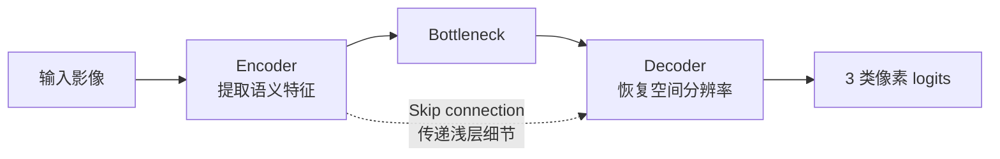

# 基于无人机多光谱影像的作物、杂草、土壤/背景区分实验进度报告

**项目：** cv-weedmap-segmentation  
**当前阶段：** Synthetic 模拟实验完成，真实 WeedMap 数据读取、标签验证、Dataset 构建、U-Net 训练及严格公平 RGB vs multispectral 对比完成

---

## 1. 项目背景与研究目标

本项目面向无人机农业遥感场景，目标是综合利用影像中的**空间纹理信息**与**多光谱/植被指数信息**，对实验田中的作物、杂草、土壤/背景进行像素级区分。

当前任务属于**语义分割**，而不是整张图片分类：

- 输入：无人机 RGB 图像或多光谱通道；
- 输出：每个像素的类别；
- 类别：`background`、`crop`、`weed`。

该目标与导师课题中实验田作物、杂草和土壤区分的研究方向一致。现阶段先利用 WeedMap 公共数据与 synthetic 数据跑通数据处理、训练、评价和可视化流程，后续可迁移至水稻田或柑橘田数据，并根据实际传感器波段与标注体系进行适配。

## 2. 整体实验路线


总体策略是先在可控的模拟数据上验证方法，再进入真实数据，以降低数据格式、标签映射、类别不平衡和模型训练等问题相互耦合带来的排查难度。

## 3. 光谱指数模拟实验

为了理解多光谱数据为何有助于区分作物、杂草和土壤，首先对三类地物的典型光谱反射率与植被指数进行了模拟。

| Class | Green | Red | RedEdge | NIR | NDVI | NDRE |
| --- | ---: | ---: | ---: | ---: | ---: | ---: |
| crop | 0.1200 | 0.0501 | 0.2398 | 0.5500 | 0.8332 | 0.3928 |
| weed | 0.1401 | 0.0701 | 0.2800 | 0.5099 | 0.7587 | 0.2912 |
| soil | 0.2000 | 0.2301 | 0.2600 | 0.2899 | 0.1151 | 0.0544 |

变量含义如下：

- **Green**：绿光波段反射率；
- **Red**：红光波段反射率；
- **RedEdge**：红边波段，常用于植被状态分析；
- **NIR**：近红外波段，健康植被通常具有较强反射；
- **NDVI**：基于 Red 与 NIR 计算的归一化植被指数；
- **NDRE**：基于 RedEdge 与 NIR 计算的归一化红边指数。

结果表明，crop 和 weed 都属于植物，因此 NDVI 均较高；soil 的 NDVI 和 NDRE 明显较低，因而土壤与植被相对容易区分。**真正困难的是 crop 与 weed 的区分：二者都具有植被光谱特征，需要进一步结合更多波段、纹理、形状和空间上下文。**

## 4. 光谱阈值 baseline 实验

采用如下可解释规则建立阈值基线：

- `NDVI < 0.4` → soil；
- `NDVI >= 0.4` 且 `NDRE >= 0.35` → crop；
- `NDVI >= 0.4` 且 `NDRE < 0.35` → weed。

| 指标 | 结果 |
| --- | ---: |
| Overall accuracy | 99.84% |
| Crop accuracy | 99.66% |
| Weed accuracy | 100.00% |
| Soil accuracy | 100.00% |

该 baseline 的意义是提供一种**简单、可解释、可复现**的参照，而非追求最强效果。由于数据是按照具有明显光谱差异的模拟分布生成，指标不能直接代表真实田间效果；后续深度学习实验应以更复杂的真实场景为准。

## 5. Synthetic 语义分割实验设计

在真实数据训练前，先用 synthetic 数据模拟实验田，以跑通“数据生成—Dataset—模型训练—指标评价—预测可视化”的完整语义分割流程：

- background 模拟土壤背景；
- crop 模拟规则排列的作物行；
- weed 模拟随机分布的小目标杂草；
- 加入噪声模拟无人机航拍与光照变化；
- 支持 RGB 和 multispectral 两类输入。

模型采用小型 U-Net，输入为 RGB 或多光谱张量，输出为 3 类 logits，分别对应 background、crop 和 weed。



- **Encoder**：逐步压缩空间尺度并提取高级语义特征；
- **Decoder**：逐步恢复空间分辨率，输出像素级预测；
- **Skip connection**：将浅层的边缘与定位细节传给解码器，有助于恢复边界和分割小目标。


*图 1：Synthetic 样本的输入、真实标签、预测标签与误差区域，用于验证完整分割和可视化流程。*

## 6. Synthetic baseline 结果

普通 `CrossEntropyLoss`（5 epochs）的结果如下：

| Pixel Accuracy | Mean IoU | Background IoU | Crop IoU | Weed IoU |
| ---: | ---: | ---: | ---: | ---: |
| 93.16% | 59.31% | 98.09% | 79.59% | 0.26% |

虽然 pixel accuracy 达到 93.16%，但 weed IoU 仅为 0.26%。这说明模型主要学会了占比较大的 background 和较明显的 crop，却几乎忽视少数类 weed。**高 pixel accuracy 并不等于三个类别都分得好，这一结果直接反映出类别不平衡问题。**

## 7. Class weights 改进实验

为增强模型对少数类的关注，将 weighted CrossEntropyLoss 的类别权重设置为：

| 类别 | Background | Crop | Weed |
| --- | ---: | ---: | ---: |
| 权重 | 1.0 | 2.0 | 6.0 |

5 epochs 结果如下：

| Pixel Accuracy | Mean IoU | Background IoU | Crop IoU | Weed IoU |
| ---: | ---: | ---: | ---: | ---: |
| 97.05% | 88.57% | 96.55% | 93.60% | 75.54% |

class weights 通过提高 weed 预测错误的损失权重，使优化过程更重视少数类。**Weed IoU 从 0.26% 提升到 75.54%，表明类别权重能有效缓解当前 synthetic 数据中的类别不平衡。**


*图 2：Synthetic weighted CE 训练历史，可观察 loss 下降及各类别 IoU 的变化。*

## 8. Synthetic 10 epochs 稳定性实验

Weighted CE 训练至 10 epochs 后的结果为：

| Train Loss | Pixel Accuracy | Mean IoU | Background IoU | Crop IoU | Weed IoU |
| ---: | ---: | ---: | ---: | ---: | ---: |
| 0.0501 | 98.85% | 94.99% | 98.79% | 96.98% | 89.19% |

训练前期 weed IoU 波动较大，随后逐渐稳定。这说明少数类 weed 的有效样本更少、形态更零散，通常需要更多轮次才能学到稳定特征。

## 9. Loss Function 对比实验

保持主要训练设置一致，对四种损失函数进行比较：

| Loss | Pixel Acc | Mean IoU | Background IoU | Crop IoU | Weed IoU |
| --- | ---: | ---: | ---: | ---: | ---: |
| CE | 98.04% | 89.71% | 98.66% | 94.34% | 76.14% |
| **Weighted CE** | **98.85%** | **94.99%** | **98.79%** | **96.98%** | **89.19%** |
| Dice | 97.23% | 85.51% | 98.64% | 91.62% | 66.27% |
| Focal | 98.00% | 91.16% | 98.18% | 94.00% | 81.30% |

- **CE**：普通交叉熵，进行逐像素多分类；
- **Weighted CE**：在 CE 中加入类别权重，提高少数类错误的代价；
- **Dice Loss**：更关注预测区域和真实区域的重叠；
- **Focal Loss**：降低容易分类样本的贡献，更关注难分类样本。

**在当前 synthetic 设置下，Weighted CE 整体最好，Focal Loss 次之。** 这也说明具体 loss 的效果依赖数据分布，仍需在真实 WeedMap 数据上复验。

## 10. Synthetic RGB vs Multispectral 对比

| 输入与设置 | Train Loss | Pixel Acc | Mean IoU | Background IoU | Crop IoU | Weed IoU |
| --- | ---: | ---: | ---: | ---: | ---: | ---: |
| RGB + weighted CE + 10 epochs | 0.0501 | 98.85% | 94.99% | 98.79% | 96.98% | **89.19%** |
| Multispectral + weighted CE + 10 epochs | **0.0360** | **98.97%** | 94.97% | **98.95%** | **97.90%** | 88.07% |


*图 3：Synthetic multispectral + weighted CE 的训练历史，用于与 RGB 输入实验对照。*

在 synthetic 数据中，多光谱输入没有在 mean IoU 和 weed IoU 上明显超过 RGB。可能原因是模拟数据中的 RGB 颜色差异已经较明显，额外光谱通道带来的信息增益有限。**该结果不代表真实数据中多光谱无效；真实无人机影像受到土壤、光照、遮挡和生长状态等因素影响，仍需通过真实对照实验验证。**

## 11. 真实 WeedMap 数据读取与结构检查

项目已经进入真实数据阶段，已完成 WeedMap Tiles 的下载解压与结构检查：

- 提取 `RedEdge_000` 至 `RedEdge_004`；
- 提取 `Sequoia_005` 至 `Sequoia_007`；
- 每张 tile 尺寸为 360 × 480；
- 共统计 1670 个候选样本；
- Dataset 构建后，RGB 模式加载 454 个样本，多光谱模式加载 884 个样本。

真实数据的主要目录包括：

```text
tile/RGB    tile/CIR    tile/B      tile/G
tile/R      tile/RE     tile/NIR    tile/NDVI
groundtruth mask
```


*图 4：真实 WeedMap 样本的 RGB、NDVI、NIR、RedEdge、GroundTruth、mask 与 overlay；结果表明 UAV 多光谱影像、标签和有效区掩膜能够正确读取并空间对齐。*

## 12. 真实 WeedMap 标签映射验证

本地逐像素验证得到如下映射：

| 数据源 | 数值/颜色 | 含义 |
| --- | --- | --- |
| GroundTruth_color | black | background |
| GroundTruth_color | green | crop |
| GroundTruth_color | red | weed |
| GroundTruth_iMap | 0 | background |
| GroundTruth_iMap | 10000 | crop |
| GroundTruth_iMap | 2 | weed |
| mask | 0 | valid area |
| mask | 255 | invalid / no-data area |

因此，训练时不能将 iMap 中的 `10000` 直接误判为 ignore。当前采用更稳妥的方式：从 `GroundTruth_color` 生成训练标签，将 black、green、red 分别映射为 0、1、2，并把 `mask=255` 的区域设置为 `ignore_index=255`。

**标签语义与无效区域必须分开处理，否则会把 crop 错误忽略，直接破坏训练与评价。**

## 13. 真实 WeedMap PyTorch Dataset

项目已实现 `weedmap_dataset.py`，支持两类输入：

- `rgb`：读取 `tile/RGB`，输出 3 通道；
- `multispectral`：读取 `tile/G`、`tile/R`、`tile/RE`、`tile/NIR`、`tile/NDVI`，输出 5 通道。

Dataset 输出定义为：

- `image`：`torch.float32`，形状 `[C,H,W]`，归一化到 0～1；
- `label`：`torch.long`，形状 `[H,W]`；
- 标签取值：0=background、1=crop、2=weed、255=ignore。

过滤规则包括：跳过缺失必要文件的样本、全黑图像、标签全为 ignore 的样本，以及有效像素过少的样本。

| Dataset | Loaded | Skipped missing | Skipped empty/invalid |
| --- | ---: | ---: | ---: |
| RGB | 454 | 700 | 516 |
| Multispectral | 884 | 0 | 786 |

第一个有效样本检查结果：

| 检查项 | 结果 |
| --- | ---: |
| Image max | > 0 |
| Label unique values | [0, 1, 2, 255] |
| Background pixels | 104834 |
| Crop pixels | 4568 |
| Weed pixels | 2756 |
| Ignore pixels | 60642 |

像素统计进一步说明真实数据存在明显类别不平衡：background 远多于 crop 和 weed，而 weed 又少于 crop。

## 14. 真实 WeedMap U-Net 训练实验

项目已实现 `train_real_weedmap_unet.py`。首轮真实数据训练设置如下：

| 参数 | 设置 |
| --- | --- |
| Input type | multispectral（5 通道） |
| Loss | weighted CE |
| Epochs | 3 |
| Batch size | 2 |
| Learning rate | 0.001 |
| Optimizer | Adam |
| Train / validation | 707 / 177 samples |
| Ignore index | 255 |
| Class weights | background=1.0, crop=4.0, weed=8.0 |

参数解释：`epochs` 是完整遍历训练集的轮数；`batch_size` 是每次送入模型的样本数；`lr` 控制每次参数更新步长；`weighted_ce` 是带类别权重的交叉熵；`ignore_index=255` 使无效区域不参与 loss 和指标；class weights 则提高 crop，尤其是 weed 错分时的惩罚。

3 epochs 的 train loss 依次为 `0.4497 → 0.2724 → 0.2532`，验证集结果为：

| Val Pixel Acc | Mean IoU | Background IoU | Crop IoU | Weed IoU |
| ---: | ---: | ---: | ---: | ---: |
| 95.61% | 56.37% | 97.15% | 56.28% | 15.68% |

loss 持续下降，说明模型能够正常学习；background IoU 很高，crop 已有初步效果，但 weed IoU 较低，说明真实杂草比模拟数据更难识别。

## 15. 真实 WeedMap 10 epochs 稳定性实验

| Epoch | Train Loss | Val Pixel Acc | Mean IoU | Background IoU | Crop IoU | Weed IoU |
| ---: | ---: | ---: | ---: | ---: | ---: | ---: |
| 1 | 0.4497 | 95.38% | 52.28% | 96.99% | 47.65% | 12.18% |
| 2 | 0.2724 | 95.25% | 52.53% | 96.84% | 49.52% | 11.24% |
| 3 | 0.2532 | 95.61% | 56.37% | 97.15% | 56.28% | 15.68% |
| 4 | 0.2455 | 95.12% | 56.41% | 96.76% | 50.87% | 21.59% |
| 5 | 0.2364 | 95.52% | 54.94% | 96.83% | 55.68% | 12.31% |
| 6 | 0.2365 | 95.50% | 54.14% | 96.81% | 53.91% | 11.70% |
| 7 | 0.2257 | 95.07% | 57.62% | 96.18% | 57.81% | 18.86% |
| 8 | 0.2099 | 96.40% | 62.65% | 97.17% | 62.13% | 28.66% |
| 9 | 0.2019 | 96.29% | 63.80% | 97.14% | 60.38% | 33.90% |
| 10 | **0.1781** | **97.22%** | **69.21%** | **97.69%** | **64.17%** | **45.76%** |


*图 5：真实 WeedMap 多光谱 U-Net 的 train loss 与验证集 mean/background/crop/weed IoU；Epoch 8 后 weed IoU 提升明显。*

3 epochs 与 10 epochs 对比如下：

| Setting | Val Pixel Acc | Mean IoU | Background IoU | Crop IoU | Weed IoU |
| --- | ---: | ---: | ---: | ---: | ---: |
| 3 epochs | 95.61% | 56.37% | 97.15% | 56.28% | 15.68% |
| **10 epochs** | **97.22%** | **69.21%** | **97.69%** | **64.17%** | **45.76%** |

训练延长后，weed IoU 从 15.68% 提升至 45.76%，mean IoU 从 56.37% 提升至 69.21%。**增加训练轮数对真实 WeedMap 的 weed 类非常有效，且 Epoch 8～10 的明显提升表明 weed 类学习速度较慢。** 同时，中间轮次仍有波动，后续需通过更长训练与多 seed 实验判断稳定性。

## 16. 严格公平 RGB vs Multispectral 对比实验

### 实验设置

- `sample_list_csv=splits/real_weedmap_common_samples.csv`；
- RGB 和 Multispectral 使用完全相同的 454 个样本；
- train samples：363；
- val samples：91；
- `input_type` 分别为 `rgb` 和 `multispectral`；
- `loss=weighted_ce`；
- `epochs=10`；
- `batch_size=2`；
- class weights：`background=1.0`、`crop=4.0`、`weed=8.0`；
- `ignore_index=255`。

两种输入使用同一个 sample list、相同样本数和相同训练/验证划分，因此这次对比比之前样本集合不同的实验更公平，可以更可靠地比较输入通道带来的差异。

### 实验结果

| Input | Train Loss | Val Pixel Acc | Mean IoU | Background IoU | Crop IoU | Weed IoU |
|---|---:|---:|---:|---:|---:|---:|
| RGB | 0.2956 | 94.28% | 65.27% | 95.49% | 65.75% | 34.56% |
| Multispectral | 0.2166 | 94.38% | 67.76% | 94.94% | 61.62% | 46.73% |

Multispectral 的 mean IoU 为 67.76%，高于 RGB 的 65.27%，说明其整体分割效果略好。Multispectral 的 weed IoU 达到 46.73%，比 RGB 的 34.56% 高 12.17 个百分点，说明多光谱通道对杂草识别更有帮助。RGB 的 crop IoU 为 65.75%，比 Multispectral 的 61.62% 高 4.13 个百分点，说明 RGB 对作物行状结构也有一定优势。对导师课题而言，weed 是关键难点，因此多光谱方向更值得继续深入。

Multispectral 在 Epoch 8 达到更好结果：mean IoU 为 70.38%，weed IoU 为 50.43%；Epoch 10 的 mean IoU 为 67.76%，weed IoU 为 46.73%。这说明训练后期存在波动，后续应该根据验证集 mean IoU 保存 best checkpoint，而不是只保存最后一轮模型。

## 17. 真实预测可视化与误差分析

### 3 epochs


*图 6：3 epochs 模型在真实样本上的输入、真值、预测与 error map，可见 weed 预测仍较少。*

### 10 epochs


*图 7：10 epochs 模型在相同流程下的预测可视化，weed 响应相较 3 epochs 明显增加。*

10 epochs、sample index=0 的定量结果如下：

| Pixel Accuracy | Background IoU | Crop IoU | Weed IoU | Mean IoU |
| ---: | ---: | ---: | ---: | ---: |
| 95.49% | 96.24% | 56.40% | 37.34% | 63.33% |

从图中可以观察到：

- 模型能够识别部分 crop 的行状结构；
- 10 epochs 后 weed 预测明显增多；
- 大部分 background 能够正确预测；
- 错误主要集中在作物/杂草边界以及零散小目标 weed 周围；
- weed 仍有漏检。

单样本指标低于整体验证集的最终指标并不矛盾，说明不同样本难度存在差异。整体上，**真实农业遥感中的 weed 具有面积小、分布散、外观与作物相近等特点，是当前最难类别之一。**

## 18. 评价指标解释

1. **Pixel Accuracy**：所有有效像素中预测正确的比例。若背景占比很大，即使 weed 预测较差，accuracy 仍可能很高。
2. **IoU**：`intersection / union`，分别计算某一类别预测区域与真实区域的交集占并集的比例。
3. **Mean IoU**：background、crop、weed 三个类别 IoU 的平均值，比 pixel accuracy 更能均衡反映分割质量。
4. **Weed IoU**：本项目最重要的指标之一。导师课题中的杂草识别是关键难点，weed 通常面积小、分布零散，并容易与作物或土壤混淆。
5. **ignore_index=255**：无效区域不参与训练 loss 和指标计算，避免模型学习无意义的黑边或 no-data 区域。

## 19. 当前阶段主要结论

1. 已从传统 CV / synthetic 实验推进到真实 UAV 多光谱语义分割数据。
2. 光谱指数实验说明土壤与植被较容易区分，但 crop 与 weed 均属于植被，二者更难区分。
3. Synthetic 实验表明，类别不平衡会使模型忽视 weed。
4. Class weights 能显著提升 weed IoU。
5. 真实 WeedMap 数据需要谨慎处理标签映射与 invalid/no-data mask。
6. 真实 U-Net 训练流程已经跑通，loss 能够正常下降。
7. 真实数据中 background 最容易、crop 次之、weed 最难。
8. 10 epochs 相比 3 epochs 明显提升 weed IoU，说明 weed 类需要更长训练。
9. 当前模型已经具备初步区分作物、杂草和土壤/背景的能力，但 weed 仍存在漏检和边界误差。
10. 严格公平对比中，RGB 和 multispectral 使用相同的 454 个样本；多光谱的 mean IoU 和 weed IoU 更高，而 RGB 的 crop IoU 略高。
11. Multispectral 在 Epoch 8 的结果优于 Epoch 10，说明训练后期存在波动，需要根据验证集 mean IoU 保存最佳模型。
12. 后续需继续开展 class weights 调整、增加训练轮数和多 seed 重复实验。

## 20. 当前项目已完成内容

| 阶段 | 内容 | 状态 |
| --- | --- | --- |
| 环境搭建 | Python、PyTorch、MPS、VS Code、Codex、GitHub | 完成 |
| 光谱基础 | NDVI/NDRE 模拟 crop/weed/soil | 完成 |
| 阈值 baseline | NDVI/NDRE 规则分类 | 完成 |
| Synthetic segmentation | crop/weed/background U-Net | 完成 |
| Class imbalance | CE vs weighted CE | 完成 |
| Loss 对比 | CE / weighted CE / Dice / Focal | 完成 |
| 输入对比 | RGB vs multispectral synthetic | 完成 |
| 真实数据读取 | WeedMap Tiles 解压和结构检查 | 完成 |
| 标签验证 | color / iMap / mask 映射验证 | 完成 |
| Dataset | WeedMapDataset | 完成 |
| 真实训练 | multispectral weighted CE 3/10 epochs | 完成 |
| 真实输入对比 | RGB vs multispectral weighted CE 10 epochs（相同 454 个样本） | 严格公平对比完成 |
| 预测可视化 | 真实样本预测图和 error map | 完成 |

## 21. 下一步实验计划

1. **保存 best model checkpoint**
   - 给 `train_real_weedmap_unet.py` 增加 best model checkpoint；
   - 根据验证集 mean IoU 保存最佳模型，避免只保留最后一轮造成指标回落。
2. **Loss 和 class weights 调参**
   - 在当前 weed 权重 8 的基础上继续比较 weed class weight = 12 和 16；
   - 比较 weighted CE、Focal Loss 和 Dice Loss。
3. **训练轮数和稳定性实验**
   - 做 20 epochs，与现有 10 epochs 结果对比；
   - 观察 weed IoU 是否继续提升，以及是否出现过拟合。
4. **多 seed 重复实验**
   - 继续做多 seed 实验，降低单次划分与初始化带来的偶然性；
   - 使用 `mean ± std` 汇报结果。
5. **数据增强**
   - 加入 random flip、rotation、brightness/noise；
   - 增强模型对无人机视角、光照和成像噪声变化的鲁棒性。
6. **迁移到导师实验田**
   - 水稻田：水稻/杂草/土壤；
   - 柑橘田：柑橘/杂草/土壤；
   - 根据真实传感器通道和数据质量调整输入与预处理。

## 22. 给导师汇报时可以说的话

老师，目前我已经完成了从模拟数据到真实 WeedMap 多光谱无人机数据的完整语义分割流程。前期我先用 NDVI、NDRE 做了作物、杂草和土壤的光谱差异模拟，之后用 synthetic 数据训练 U-Net，发现普通 CE 会忽视 weed，加入 class weights 后 weed IoU 大幅提升。接着我整理了真实 WeedMap Tiles 数据并完成标签映射验证；本地数据中 color 标签的类别语义最明确，因此 Dataset 从 GroundTruth_color 生成 0/1/2 标签，并把 mask=255 作为 ignore 区域。严格公平的 RGB 与 multispectral 对比使用相同的 454 个样本，其中 train 363 个、val 91 个。Multispectral 的 mean IoU 为 67.76%，高于 RGB 的 65.27%；weed IoU 为 46.73%，也明显高于 RGB 的 34.56%，说明多光谱通道对杂草识别更有帮助。RGB 的 crop IoU 略高，说明 RGB 对作物行状结构也有一定优势。由于 weed 是课题的关键难点，多光谱方向更值得深入。Multispectral 在 Epoch 8 达到 70.38% mean IoU 和 50.43% weed IoU，优于 Epoch 10，后续会增加 best checkpoint，并继续比较 weed class weight、20 epochs 和多 seed 结果。
